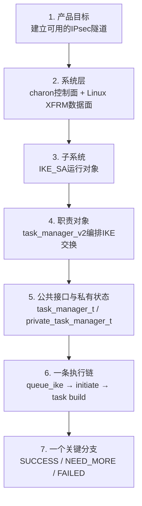
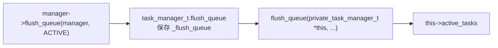
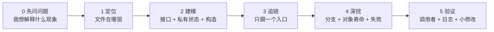
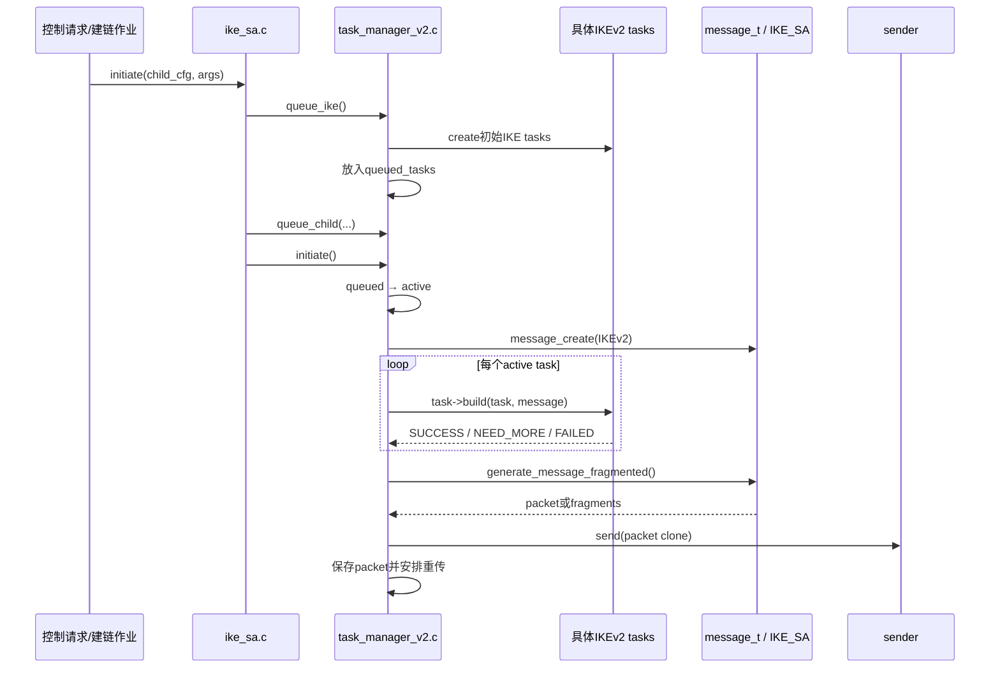
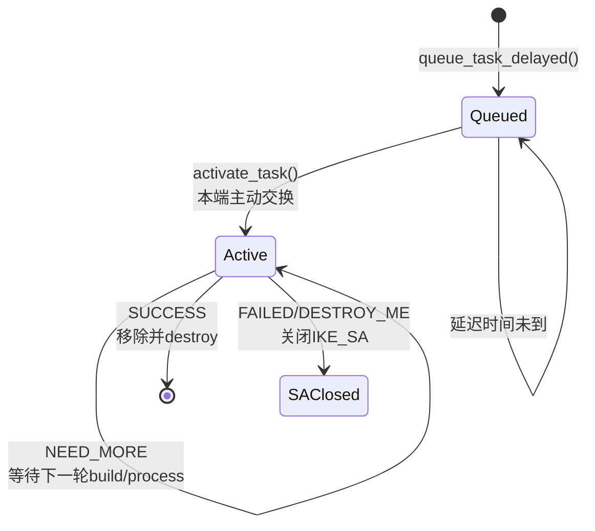

> 适用基线：strongSwan 6.0.3 上游源码，commit `472dcd8bb50a91f156b725ff56992352b573f7dd`<br>
> 本文目标：面对一个陌生 strongSwan C 文件时，能还原它在系统中的位置、对象、输入、状态、输出和真实执行路径<br>
> 完整示例：`src/libcharon/sa/ikev2/task_manager_v2.c` 的主动建链路径<br>
> 学习顺序：先读本文，再用 [IKEv2 Task Manager 源码精读](strongSwan%20IKEv2%20Task%20Manager%20源码精读.md) 展开协议细节

## 1. 你真正要学的不是“看完代码”

strongSwan 源码难读，不是因为每行 C 都很难，而是因为一个短函数往往只是大型协议系统的一个横截面。如果不知道它在整体中的位置，即使认识每个 C 语句，也会有“每行都懂，合起来不知道在干什么”的感觉。

strongSwan 尤其同时包含了：

- 用 C 结构体和函数指针模拟的“对象”；
- IKEv1/IKEv2 状态机和多轮报文交换；
- 插件、抽象接口和运行时实现选择；
- 调度队列、定时任务、重传和并发消息；
- 从配置、协议、密钥到 Linux XFRM 的跨层路径。

因此，源码阅读的本质不是“把文件从第一行读到最后一行”，而是做一次可验证的系统重建：

```text
当前问题
→ 输入从哪里来
→ 谁接收它
→ 它修改了哪个长期对象
→ 根据什么选择分支
→ 产生什么输出
→ 下一个消费者是谁
→ 失败时什么会被保留或销毁
```

你的最终标准不是“我读过这个文件”，而是：

> 我能把它放回整个系统，说清谁调它、它改了什么、结果去了哪里，并能在本地源码中重新找到。

## 2. 先建立“七层缩放”，不要直接钻进函数

遇到陌生代码时，先从大到小建立坐标。每次只向下缩放一层。



如果对第 3 层还没有概念，不应直接纠结第 7 层的某个 `switch` 分支。否则会得到很多零散细节，却形不成能用于排障和修改的系统理解。

### 2.1 一个文件的六坐标卡

每次阅读新文件，先写出下面六项。第一遍不要追求完整，先有一个可修正的假设。

| 坐标 | 要回答的问题 | `task_manager_v2.c` 的答案 |
| --- | --- | --- |
| 系统位置 | 它属于哪个进程、协议版本和层次？ | `charon` 的 IKEv2 控制面 |
| 对象 | 这个文件实现了什么长期对象？ | 每条 `IKE_SA` 所拥有的 IKEv2 task manager |
| 职责 | 它做决策、做细节，还是转交给别人？ | 编排 task、exchange、报文和重传，不自己实现所有 Payload |
| 输入 | 谁会调用它，带来什么？ | `ike_sa.c` 带来建链意图或已解析的 `message_t` |
| 持久状态 | 哪些数据跨函数、跨报文存活？ | 三类 task 队列、Message ID、交换类型、重传报文等 |
| 输出 | 它将什么交给下一层？ | 生成的 IKE packet、更新后的 `IKE_SA`/task 状态或销毁决策 |

这张卡写完后，文件里的函数才不再是孤立的。

## 3. 阅读 strongSwan 前必须过的 C 语言桥梁

你不需要先学完整本 C 语言才能读 strongSwan，但下面的对象模型必须先看懂。

### 3.1 公共接口是一组函数指针

`src/libcharon/sa/task_manager.h` 中的 `task_manager_t` 不是一个有业务字段的完整对象，它主要是外部可见的“能力目录”：

```c
struct task_manager_t {
    status_t (*process_message)(task_manager_t *this, message_t *message);
    status_t (*initiate)(task_manager_t *this);
    void (*queue_ike)(task_manager_t *this);
    void (*flush_queue)(task_manager_t *this, task_queue_t queue);
    /* 还有其他方法 */
};
```

当代码执行：

```c
manager->initiate(manager);
```

人话是：

> 取出 `manager` 对象对外公布的 `initiate` 函数指针，并把对象自己当作第一个参数传入。

这就是 C++ 成员函数中隐藏 `this` 参数的手工版本。

### 3.2 私有结构体才保存真实状态

`task_manager_v2.c:63` 的 `private_task_manager_t` 把公共接口放在第一个字段，后面再保存私有状态：

```text
private_task_manager_t
├── public                  对外暴露的 task_manager_v2_t
│   └── task_manager        通用 task_manager_t 接口
├── ike_sa                  当前 manager 服务的 IKE_SA
├── responding              本端响应对端请求的交换状态
├── initiating              本端主动发起的交换状态
├── queued_tasks            已排队、还未激活的 task
├── active_tasks            本端主动执行的 task
├── passive_tasks           处理对端请求的 task
└── retransmit / reset ...  重传与调度状态
```

这里最重要的问题是：哪些字段会在返回当前函数后继续存在？

- 局部变量 `message` 只服务于当前调用；
- `this->active_tasks` 会跨越多轮 IKE 报文继续存在；
- `this->initiating.mid` 和 `packets` 要支持响应匹配和超时重传。

只有分清“当前函数的临时数据”和“协议对象的长期状态”，才能读懂状态机。

### 3.3 `METHOD()` 到底生成了什么

以下写法：

```c
METHOD(task_manager_t, flush_queue, void,
    private_task_manager_t *this, task_queue_t queue)
{
    /* ... */
}
```

第一遍阅读时，可以在脑中简化为：

```c
static void flush_queue(private_task_manager_t *this, task_queue_t queue)
{
    /* ... */
}
```

但工程上需要再多理解一层。`src/libstrongswan/utils/utils/object.h:99-103` 的宏实际做了三件事：

1. 用 GCC `transparent_union` 声明一个既能接受公共接口指针，又能接受私有对象指针的函数类型；
2. 定义以私有类型 `private_task_manager_t *this` 书写的真实函数；
3. 创建 `_flush_queue` 函数指针，用于绑定到公共接口。

> **一个容易被简化过度的地方**
> `_flush_queue` 可以在心智模型中理解为“公共接口的入口”，但它不是另外生成的一层转发函数。它是指向同一个实现的类型适配函数指针，没有先进 `_flush_queue()` 再跳转 `flush_queue()` 的两次业务调用。
>

为什么指针能从公共接口还原成私有对象？因为上述公共结构体被放在外层结构体的第一个字段，这些第一子对象与完整对象具有相同起始地址。



### 3.4 `INIT()` 不只是“创建对象”四个字

`object.h:44-45` 的 `INIT()` 使用 `malloc()` 分配内存，再用 C 复合字面量和指定初始化器给整个结构体赋值。不要误以为它是 `calloc()`，但复合字面量中未指定的字段会按 C 初始化规则置零。

`task_manager_v2_create()` 中的初始化可以拆成：

```text
分配 private_task_manager_t
→ 把公共方法绑定到 _process_message / _initiate / _queue_ike ...
→ 保存所属 ike_sa
→ 建立 queued / active / passive 三类容器
→ 设置初始交换类型
→ 读取重传配置
→ 只向外返回 &this->public
```

构造函数之所以要早读，是因为它同时回答了：

- 这个文件实现了哪个对象；
- 对外提供什么方法；
- 初始状态是什么；
- 它依赖哪些其他对象；
- 外部持有的是公共指针还是私有指针。

### 3.5 `task->build()` 是动态分派，不是一个固定实现

`task_t` 也是函数指针接口。Task Manager 不需要知道手里的 `task_t *` 具体是 `ike_init` 还是 `ike_auth`，只需要调用统一接口：

```c
status = task->build(task, message);
```

运行时真正进入哪个 `build()`，由创建该 task 时绑定的函数指针决定。因此，从 `task->build()` 继续往下追时，必须先回答：

> 当前 `task` 在这一轮可能是哪些具体 task？

不能在不知道具体对象类型的情况下，把这个调用当成只有一个固定下一站。

## 4. 五遍阅读法：每一遍只解决一种问题

同一个文件可以读五遍，但每遍目标必须不同。这比第一次就试图理解每个分支快得多。



### 第 0 遍：把目标写成一个能被回答的问题

好问题：

- 本端发起 IKEv2 时，`IKE_SA_INIT` 的 task 如何被排队并发送？
- 一个 task 返回 `NEED_MORE` 后，状态被谁保存？
- 为什么响应回来后会从 `IKE_SA_INIT` 进入 `IKE_AUTH`？

坏问题：

- 今天看懂 `task_manager_v2.c`；
- 理解整个 IKEv2；
- 把 2600 多行都读一遍。

坏问题没有明确输入、输出和停止点，所以必然导致无限展开。

### 第 1 遍：只定位，不读函数体

先看：

1. 路径中的模块名和协议版本；
2. 同名 `.h` 文件的公共接口；
3. `.c` 文件的 `#include`，但只按职责分组；
4. 谁创建这个对象，谁保存它。

例如：

```text
src/libcharon/sa/ikev2/task_manager_v2.c
             │       │
             │       └─ IKEv2专用实现
             └─ Security Association运行层
```

这一遍的停止条件是：能用一句话说出文件职责，但不要开始解释协议细节。

### 第 2 遍：只重建对象

阅读顺序是：

```text
公共头文件
→ private结构体
→ create构造函数
→ destroy析构函数
```

这一遍只回答：

- 外部能调用什么？
- 对象在内部记住什么？
- 哪些依赖只是借用，哪些资源由它创建并销毁？
- 初始状态是什么？

如果没有读 `destroy()`，对象理解往往只完成了一半。析构函数能告诉你谁真正拥有容器、报文、凭据和子对象。

### 第 3 遍：只追一条从输入到输出的路径

选一个公共入口，为每一站记录：

| 站点 | 输入 | 读哪些状态 | 改哪些状态 | 输出/下一站 |
| --- | --- | --- | --- | --- |
| 函数 A | 谁传来什么 | `this->...` | `this->...` | 返回值或调用 B |

只有当某个辅助函数会改变你当前问题的答案时，才继续展开它。

### 第 4 遍：阅读对象生命周期和失败分支

对每个关键指针问：

```text
谁create/malloc？
谁放入容器？
谁从容器移除？
谁destroy/free？
返回NEED_MORE后它还在吗？
返回FAILED后是销毁task，还是销毁整条IKE_SA？
```

这一遍是从“会读代码”进入“能审查协议实现”的关键。一个正常路径能工作，不代表错误路径没有泄漏、重复释放或静默降级。

### 第 5 遍：用代码外证据证明这是真实路径

对一条高价值链路，最少使用两类交叉证据：

- 向上找调用者，证明入口真的可达；
- 向下找输出消费者，证明结果真的被使用；
- 对应运行日志，证明分支在当前环境执行；
- 对应 PCAP 中的 exchange、Message ID 或 Payload；
- 在安全边界内加一条临时日志或修改一个无害分支，重新构建并验证。

对于本文的教学目标，只看代码是第一轮；能把它与真实 IKE 日志和报文对应起来，才形成工程闭环。

## 5. 工具不是目的：一次手工定位的完整示范

下面不使用一键脚本。你要亲手运行一次，理解每条命令对应阅读法的哪一步。

### 5.1 进入固定源码基线

```bash
cd /path/to/workspace/learning-sources/strongswan-6.0.3
```

- `cd` 是 change directory，把当前工作目录切换到指定路径；
- 这里使用从 `/` 开始的绝对路径，不受当前所在目录影响；
- 成功时通常没有输出，提示符所在目录会变化；
- 如果提示路径不存在，先不要改命令，确认固定源码是否被移动。

本次只读文件，不需要 `sudo`。

### 5.2 确认版本，防止行号和结构对不上

```bash
git rev-parse HEAD
```

期望输出：

```text
472dcd8bb50a91f156b725ff56992352b573f7dd
```

`git rev-parse HEAD` 输出当前检出提交。如果与上述值不同，不是说新版本一定错，而是不能继续盲信本文的行号；应该重新搜索符号。

### 5.3 不打开文件，先建立符号骨架

```bash
rg -n '^struct private_task_manager_t|^METHOD\(task_manager_t, (queue_ike|initiate|process_message)|^task_manager_v2_t \*task_manager_v2_create' \
  src/libcharon/sa/ikev2/task_manager_v2.c
```

命令拆解：

- `rg` 是 ripgrep，用于高速搜索文本；
- `-n` 要求显示行号；
- 单引号保护其中的 `|` 和括号，避免 Shell 先解释；
- `^` 表示行首，减少注释和调用处的干扰；
- 命令末尾的 `\` 表示下一行仍属于同一条命令。

你应该看到的关键位置包括：

```text
63:struct private_task_manager_t {
516:METHOD(task_manager_t, initiate, status_t,
1850:METHOD(task_manager_t, process_message, status_t,
2084:METHOD(task_manager_t, queue_ike, void,
2613:task_manager_v2_t *task_manager_v2_create(ike_sa_t *ike_sa)
```

这一步的产物不是“搜到了几个行号”，而是得到一张阅读地图：

```text
对象内存布局：63
主动执行入口：516
被动收包入口：1850
初始建链任务来源：2084
对象组装方式：2613
```

### 5.4 只显示当前需要的行

```bash
nl -ba src/libcharon/sa/ikev2/task_manager_v2.c | sed -n '2613,2657p'
```

- `nl -ba` 给所有行加可见行号，包括空行，因此能和编辑器行号对应；
- `|` 是管道，把左边命令的输出交给右边；
- `sed -n '2613,2657p'` 只打印该范围，避免整个文件淹没当前问题。

这个命令只读文件，不会修改源码，也不需要清理。

### 5.5 查找上游调用者，证明入口真的被使用

```bash
rg -n 'task_manager->(queue_ike|initiate|process_message)' \
  src/libcharon/sa/ike_sa.c
```

关键结果是：

- `ike_sa.c:1611` 调用 `queue_ike()`；
- `ike_sa.c:1655` 调用 `initiate()`；
- `ike_sa.c:1688` 将收到的 `message_t` 交给 `process_message()`。

现在才可以确认 Task Manager 不是一个孤立工具类，而是 `IKE_SA` 对象内部真正的协议交换编排器。

## 6. 完整实战：读懂 IKEv2 主动建链的一条路径

本次不问“Task Manager 所有功能是什么”，只问：

> 当一条新 `IKE_SA` 主动发起连接时，初始 task 怎样从创建、排队、激活，变成真正发出的 `IKE_SA_INIT` 报文？

### 6.1 先看整体，再看函数



这张图先告诉你职责边界：

- `ike_sa.c` 是一条 IKE 安全关联的上下文和外部入口；
- Task Manager 选择何时让哪些 task 工作；
- 具体 task 负责自己那部分协议 Payload 和状态；
- `message_t`/`IKE_SA` 负责报文表示、生成和相关密码处理；
- sender 只负责把已生成的 packet 发向网络。

### 6.2 站点一：`ike_sa.initiate()` 把业务意图变成任务

`ike_sa.c:1577-1655` 首先处理本地和对端地址、当前 `IKE_SA` 状态以及是否还要创建 CHILD_SA。

关键操作是：

```text
如果IKE_SA刚创建
→ task_manager.queue_ike()

如果同时要建立数据隧道
→ task_manager.queue_child(...)

完成排队
→ task_manager.initiate()
```

这里的输入是“建立连接”的业务意图，输出不是报文，而是一组待执行的协议 task。这是第一个关键转换：

```text
业务动作 → 协议任务
```

### 6.3 站点二：`queue_ike()` 只创建和排队，还没有发包

`task_manager_v2.c:2084-2139` 会根据是否已存在同类 task，创建 `ike_init`、`ike_auth`、`ike_natd`、证书处理、配置、MOBIKE 和 `ike_establish` 等 task。

一个重要理解是：

> `queue_ike()` 不是“构造一个 IKE_SA_INIT 报文”，而是“为整个初始建链过程准备一组能跨多轮交换存活的 task 对象”。

此时 task 被包在 `queued_task_t` 中，与最早允许启动时间一起放入 `queued_tasks`。

### 6.4 站点三：`activate_task()` 改变的是 task 归属

`task_manager_v2.c:295-320` 的 `activate_task()` 在 `queued_tasks` 中找到指定类型，确认延迟时间已到，然后：

```text
从queued_tasks移除queued_task_t
→ 把其内部task指针放入active_tasks
→ 释放只服务于排队的queued_task_t外壳
```

这个函数没有创建新的协议 task，只是转移所有权和执行状态。



### 6.5 站点四：`initiate()` 不是一大块，而是六个阶段

`task_manager_v2.c:516-787` 很长，但第一遍只把它压缩为下表：

| 阶段 | 代码作用 | 关键输入 | 关键输出/状态变化 |
| --- | --- | --- | --- |
| 阻止并发请求 | 已有一个本端请求在飞时延后新任务 | `initiating.type` | 返回或重发延迟交换 |
| 按 `IKE_SA` 状态激活 task | `IKE_CREATED` 时优先激活初始建链 task | `ike_sa->get_state()` | queued → active，选出 `IKE_SA_INIT` |
| 处理已激活 task | 后续轮次根据 task 类型选 `IKE_AUTH` 等 exchange | `active_tasks` | 设定 exchange |
| 创建报文骨架 | 写入 Message ID、源/目地地址和 exchange type | `initiating.mid`、host | `message_t` |
| 让各 task 填充报文 | 依次调用 `task->build()` | active task + message | Payload、task去留和失败决策 |
| 生成、发送并安排重传 | 将 message 生成 packet/分片并进入发包通道 | message | packet、重传缓存和 timer job |

现在再看 `initiate()` 的局部变量，就不必一个个害怕：

```text
enumerator / task  遍历active_tasks
message            当前正在构造的IKE消息
me / other         消息的源和目的主机地址
exchange           本轮要发送的IKE交换类型
result             报文是否成功生成
```

第一遍只判断它们在链条中的角色，不需要跟踪每次赋值。

### 6.6 站点五：`task->build()` 的返回值是 manager 与 task 的控制语言

`task_manager_v2.c:702-731` 遍历 `active_tasks` 并调用每个具体 task 的 `build()`。

| 返回值 | 精确含义 | manager 的动作 |
| --- | --- | --- |
| `SUCCESS` | 该 task 已完成；“完成”不一定等于业务成功 | 从 active 移除并 `destroy()` |
| `NEED_MORE` | 当前轮已处理，但仍需后续 `build/process` | 保留在 active，使对象内部状态跨报文存活 |
| `FAILED` | 发生关键失败 | 通知 down、销毁 message、清空并返回 `DESTROY_ME` |
| `DESTROY_ME` | IKE_SA 应结束 | 进入整条 IKE_SA 销毁路径 |

此时可以看到 strongSwan 的一个核心设计：

> Task Manager 只负责“什么时候调用、根据返回值怎样调度”，每个具体 task 负责自己的协议语义和内部阶段。

因此，Task Manager 是编排器，task 也是状态机的一部分。不要为 Task Manager 的一个大 `switch` 就误以为它单独包含完整 IKEv2 状态机。

### 6.7 站点六：从 `message_t` 到网络 packet

`initiate()` 并不直接调用 Socket `sendto()`。它先调用 `generate_message()`：

```text
message_t
→ ike_sa.generate_message_fragmented()
→ 一个或多个packet_t
→ 保存到initiating.packets
→ retransmit(mid)
→ send_packets()
→ charon->sender->send()
→ 安排retransmit_job
```

函数名 `retransmit()` 容易造成误解：`initiate()` 在初次发送时也进入这条统一的“发送+重传调度”路径。`initiating.retransmitted` 初始为 0，先发出缓存 packet，再把计数加一并创建定时作业。

这一站完成了第二个关键转换：

```text
协议任务和对象状态 → 可以发到网络的字节 packet
```

### 6.8 将整条链压缩成一张输入输出表

| 函数 | 输入从哪里来 | 主要读取 | 主要写入 | 下一站 |
| --- | --- | --- | --- | --- |
| `ike_sa.initiate()` | 上层的建链请求 | `IKE_SA` 状态、host、cfg | 原始发起方条件、task队列 | `queue_ike()` / `queue_child()` / `initiate()` |
| `queue_ike()` | `ike_sa.initiate()` | 已排队的 task 类型 | `queued_tasks` | 等待 `initiate()` |
| `activate_task()` | `initiate()` 中的状态选择 | task 类型和延迟时间 | queued 减少，active 增加 | `task->build()` |
| `initiate()` | `ike_sa` 或后续 task 触发 | `IKE_SA` 状态、active task、Message ID | exchange、message、task 生命周期、packets | `generate_message()` / `retransmit()` |
| 具体 `task->build()` | Task Manager 的遍历 | task 内部阶段和 `IKE_SA` 上下文 | Payload、task 内部状态、可能的 `IKE_SA` 状态 | 返回调度状态 |
| `generate_message()` | 已填充的 `message_t` | Payload、密码上下文、MTU/分片条件 | `packet_t` 数组 | `retransmit()` |
| `retransmit()` | 当前 Message ID 和 packet 缓存 | 重传次数和配置 | 发送、计数、timer job | sender / scheduler |

如果你能不看正文重画这张表，就不再只是认识函数名。

## 7. 如何拆解一个 200 行以上的函数

不要用“从上到下翻译每一行”的方式读长函数。先把代码块分成下面六类：

| 类别 | 典型代码 | 阅读问题 |
| --- | --- | --- |
| 前置守卫 | `if (...) return ...` | 哪些状态下根本不允许继续？ |
| 状态/类型选择 | `switch (state)` | 什么输入决定本次路径？ |
| 对象创建 | `*_create()` / `INIT()` | 新对象由谁拥有？ |
| 容器遍历 | `enumerator->enumerate()` | 对哪类对象执行统一接口？ |
| 副作用 | 改 `this->...`、发包、调度 job | 当前调用结束后，系统发生了什么持久变化？ |
| 错误收口 | `FAILED` / `DESTROY_ME` | 局部任务失败为什么会上升到 IKE_SA？ |

以 `initiate()` 为例，第一轮在编辑器中只留下六条注释：

```text
1. 拒绝同时存在两个本端请求
2. 根据IKE_SA状态把task从queued移到active
3. 决定本轮exchange
4. 创建message骨架
5. 遍历active task填充message
6. 生成packet、发送、安排重传
```

只有当你要回答“为什么选了 `INFORMATIONAL`”时，才展开第 2、3 块；要回答“为什么 task 没有被保留”时，才展开第 5 块。

这就是“问题驱动的选择性展开”，而不是偷懒或回避细节。

## 8. 一个函数的标准阅读卡

遇到真正需要精读的函数，不要立即写大段笔记。先填下面的卡：

```markdown
## 函数

- 所属文件与版本：
- 被谁调用：
- 输入：
- 输入的所有权：借用 / 转移 / 本函数销毁
- 执行前提：
- 读取的持久状态：
- 写入的持久状态：
- 关键子调用：
- 返回值语义：
- 副作用：
- 失败时清理什么：
- 输出被谁继续使用：
- 日志/PCAP/系统状态如何验证：
```

以 `activate_task()` 为例：

| 字段 | 答案 |
| --- | --- |
| 被谁调用 | `initiate()` 根据 `IKE_SA` 状态和优先级调用 |
| 输入 | manager 私有对象、目标 `task_type_t` |
| 执行前提 | 目标 task 已在 `queued_tasks`，延迟时间已到 |
| 读取 | `queued_tasks`、当前单调时间 |
| 写入 | 从 queued 移除，向 active 插入 |
| 寿命 | 保留具体 task，释放 `queued_task_t` 外壳 |
| 返回 | `TRUE` 表示找到并激活，`FALSE` 表示没有可激活的该类 task |
| 下一步 | `initiate()` 依据激活结果选择 exchange，后续调用 `task->build()` |

## 9. 不要忽略内存所有权：它是 C 代码里隐藏的数据流

在 strongSwan 中，“这个指针最后由谁销毁”与“这个协议状态最后由谁维护”往往是同一个问题的两面。

### 9.1 遇到指针时固定问五件事

1. 谁创建它？
2. 当前函数只是借用，还是接管了所有权？
3. 如果放入容器，容器销毁时会不会自动销毁元素？
4. 正常路径谁释放？
5. 提前返回和错误路径谁释放？

### 9.2 Task Manager 主线中的一个代表性例子

`queue_task_delayed()` 创建 `queued_task_t` 外壳，内部保存具体 `task_t *`。`activate_task()` 激活时：

- 从 `queued_tasks` 取出外壳；
- 把内部 task 放入 `active_tasks`；
- `free(queued)` 只释放外壳；
- task 返回 `NEED_MORE` 时仍由 active 队列拥有；
- task 返回 `SUCCESS` 时从 active 移除并 `task->destroy()`。

如果只看“数据从哪个队列移到哪个队列”，没有同时看外壳和内部 task 的不同寿命，就容易对 `free()` 产生误判。

## 10. 从当前函数向上、向下各追一步

阅读一个函数时，不要只看它的函数体。强制自己做一次“上下游校验”：


例如读 `task_manager_v2.initiate()`：

- 向上：`ike_sa.initiate()` 为什么和何时调用它？
- 当前：它怎样从 `IKE_SA` 状态和 task 类型选择 exchange？
- 向下：它生成的 packet 如何进入 sender，响应回来后又如何进入 `process_response()`？

每个方向先追一步就够。如果向上追了十层还没有回到当前问题，说明问题边界又丢了。

## 11. IKEv1 和 IKEv2 的阅读策略不能机械复制

本文选 `task_manager_v2.c` 作为完整示例，因为当前主业发展以 IKEv2/IPsec 为主。但这套阅读方法可以迁移到 `task_manager_v1.c`，不能直接把细节结论复制过去。

| 维度 | IKEv2 Task Manager | IKEv1 Task Manager |
| --- | --- | --- |
| 具体 task | `ike_init`、`ike_auth`、`child_create`等 | `main_mode`、`aggressive_mode`、`quick_mode`、XAuth 等 |
| 交换组织 | `IKE_SA_INIT`、`IKE_AUTH`、`CREATE_CHILD_SA`、`INFORMATIONAL` | Main/Aggressive/Quick/Informational 及扩展流程 |
| 任务容器实现 | 6.0.3 中主要使用 `array_t` | 具体实现和字段不能根据 v2 想当然，应单独核对 |
| 协议语义 | Message ID、task激活和密钥阶段按 IKEv2 定义 | 状态和多种 mode 按 IKEv1 定义 |
| 可迁移的方法 | 先看接口、private、create，再追一条路径 | 完全可迁移 |

阅读 IKEv1 的正确方式是重新填一遍六坐标卡，然后追：

```text
初始建链意图
→ Main Mode或Aggressive Mode task排队
→ 主动build/request
→ 响应process
→ 下一轮交换
```

不要先追 DPD、XAuth、Mode Config 和所有重传特殊情况。这些在基本 Main Mode 路径成立后再增量展开。

## 12. 编辑器应该怎样用

VS Code 或其他编辑器可以加快导航，但不能替代路径判断。

### 12.1 推荐的操作顺序

1. 在大纲/Outline 中找 `struct private_*`、构造函数和当前入口；
2. 用 Go to Definition 看公共接口和类型定义；
3. 用 Find References 找直接调用者，再用 `rg` 核对；
4. 折叠无关辅助函数，同时保留 private struct、create 和一条入口链；
5. 用书签标记“输入”、“状态改变”、“输出”三类位置。

### 12.2 为什么有时 Go to Definition 会失效

strongSwan 大量使用宏、条件编译、函数指针和生成配置。如果编辑器没有当前构建所用的编译参数和 `compile_commands.json`，索引可能无法判断实际分支。

此时：

- 编辑器用于快速跳转；
- `rg` 用于穷举符号和调用点；
- 实际构建参数用于判断某个 `#ifdef` 是否进入产物；
- 运行日志或断点用于证明某个间接调用真的发生。

## 13. AI 应该帮你做什么，什么不能替你判断

阅读大型源码很适合 AI 加速，但必须把搜索工作和技术判断分开。

### 13.1 可以大量交给 AI 的工作

- 列出某文件的结构体、公共方法和直接调用者；
- 将 `METHOD`/`INIT` 宏还原成普通 C 心智模型；
- 从大函数中提取守卫、状态选择、副作用和错误收口；
- 生成“输入→状态变化→输出”初稿表格；
- 对比 v1/v2 两个版本的同名接口；
- 为一个已知路径生成调试日志、单元测试或负面测试草案。

### 13.2 必须由你拥有的判断

- 当前问题应该追哪条路径，不应追哪些分支；
- AI 给出的函数是否属于当前固定版本和实际构建；
- 当前指针的具体运行类型和所有权；
- 返回值在协议语义上代表什么；
- 某个修改是否破坏状态机、重传、重协商或安全降级规则；
- 什么证据才足以说明代码路径在真实产物中生效。

### 13.3 向 AI 提问的最小合格格式

```text
源码基线：strongSwan 6.0.3 + commit
当前问题：只解释一个可验证现象
入口：已知函数或需要搜索的字段
要求输出：
1. 文件/函数/行号
2. 输入从哪来
3. 读写哪个长期对象
4. 输出去哪里
5. 一个失败分支
6. 已确认、推断和待验证分开
7. 不展开与当前问题无关的子系统
```

最后由你在本地使用 `rg`、编辑器和固定 commit 核对。AI 生成的调用链是搜索加速器，不是原始证据。

## 14. 六种常见的“看似在学，实际没有建模”

### 14.1 从第一行顺序读到最后一行

问题：辅助函数的出现顺序不等于运行顺序。

修正：先读接口、private、create，再从外部入口追一条链。

### 14.2 搜到同名函数就认为找到真实路径

问题：宏、版本分支、插件、函数指针和条件编译都可能让同名符号不可达。

修正：一定向上找调用者，向下找输出消费者，最后用运行证据确认。

### 14.3 只记函数名，不记对象变化

问题：函数名会随版本改变，而协议过程的输入、状态和输出更稳定。

修正：每次笔记至少写一个 `this->field` 的读写变化。

### 14.4 从 `task->build()` 直接假设下一个函数

问题：这是动态接口，不同具体 task 有不同实现。

修正：先通过 task 的创建处和 `get_type()` 确定具体类型，再进具体 task 文件。

### 14.5 只看成功路径

问题：安全协议实现的价值往往体现在异常报文、重传、超时、验证失败和降级处理。

修正：每条成功链至少选一个代表性失败分支，说清清理和上报边界。

### 14.6 把“能编译”当成“修改已生效”

问题：修改可能未进入目标构建、未部署、未被加载，或运行没有经过该分支。

修正：以后的真实修改必须闭合：

```text
源码基线 → diff → 构建产物 → 运行二进制身份
→ 真实执行分支 → 原始日志/PCAP → 负面测试 → 回归
```

## 15. 将方法迁移到其他 strongSwan 文件

这套方法不只适用于 Task Manager。

### 15.1 读具体 task，例如 `ike_init.c`

```text
公共task_t接口
→ private_ike_init_t内部阶段
→ ike_init_create()绑定build/process
→ 发起方build()写入Proposal/KE/Nonce
→ process()读取对端结果
→ 协商结果交给IKE_SA/keymat
```

当前问题只是“Proposal 怎样进报文”时，不展开所有 INVALID_KE 和 Cookie 分支。

### 15.2 读 keymat

```text
接口先回答：对外提供哪些派生和取密钥能力
→ private字段回答：长期保存哪些密钥对象
→ create回答：版本和算法实现如何绑定
→ 选一条derive_ike_keys路径
→ 记录输入秘密、Nonce、SPI和输出密钥的消费者
```

密钥代码额外关注销毁、日志泄漏和 HSM/软件边界，不要在调试中打印真实密钥。

### 15.3 读 kernel-netlink

```text
上游输入：CHILD_SA协商结果
→ 公共抽象：kernel_ipsec_t
→ 具体实现：kernel_netlink_ipsec_t
→ 输入数据：SPI、算法、密钥、selector、模式、lifetime
→ 输出：Netlink XFRM消息
→ 可见结果：ip xfrm state / policy
```

这里的完成标准不是看到“SA 安装成功”日志，而是能将源码参数与内核 XFRM 对象的字段对应起来。

## 16. 现在怎样学：三层内容和代表性通关

### 核心掌握

你必须亲手完成：

1. 用本文的五遍法重新找到 `task_manager_v2.c` 主动链；
2. 画出 `queued → active → SUCCESS/NEED_MORE` 对象变化；
3. 选 `initiate()` 的一个守卫分支或失败分支，说清为什么存在；
4. 在不看文档的情况下，用搜索重新定位这些符号。

### 工程会用

你需要知道用途并能借助搜索定位：

- `task_manager_v1.c` 的 Main Mode 主动路径；
- `process_message()` 怎样区分 request 和 response；
- `task->pre_process/post_process`、分片和重传的大致位置；
- 具体 task 如何用相同对象模型实现自己的 `build/process`。

### 暂不展开

在基本主线没有通关前，暂不追：

- 所有 MOBIKE 碰撞与路径探测分支；
- ME 条件编译下的媒介扩展；
- 全部 rekey/reauth 碰撞处理；
- 每个 task 的每个 Notify 和兼容分支。

“暂不展开”不是永远不学，而是不让低频细节抢走高价值主线的注意力。

## 17. 实战练习

### 练习 A：重建 IKEv2 主动链

不看本文第 6 节，在 45 分钟内回答：

1. `queue_ike()` 由谁调用？
2. 它创建了哪些主要 task？
3. task 何时从 queued 移到 active？
4. `message_t` 何时创建，Message ID 从哪里来？
5. task 怎样将内容写入 message？
6. packet 由谁生成，由谁发送？
7. 初次发送为什么也会进入名为 `retransmit()` 的函数？

### 练习 B：迁移到 IKEv1，不复制 IKEv2 结论

使用相同模板阅读 `src/libcharon/sa/ikev1/task_manager_v1.c`，只追一条 Main Mode 主动路径。产出：

- 六坐标卡；
- 公共接口→private→create 的对象图；
- 一张输入/状态/输出表；
- 与 IKEv2 相同的设计方法和不同的协议语义各三条。

### 练习 C：追一个失败分支

选择 `task->build()` 返回 `FAILED` 的路径，回答：

- 当前 `message_t` 何时销毁？
- 队列何时清空？
- 为什么失败会上升为 `DESTROY_ME`？
- 上层收到 `DESTROY_ME` 后还会做什么？
- 运行时可能观察到什么日志或缺失的响应？

## 18. 掌握门槛

下面八项全部达到，才算完成“我会读 strongSwan 代码”的第一个代表性通关：

- [ ] 能先用一句话说出当前文件在系统中的位置和职责；
- [ ] 能解释公共接口、私有结构体和构造函数的关系；
- [ ] 能准确解释 `METHOD()`、`_name`、`this` 和 `INIT()`；
- [ ] 能不借助现成行号，用搜索重新找到主动建链的起点和终点；
- [ ] 能说清 `queued_tasks`、`active_tasks`、`passive_tasks` 的语义；
- [ ] 能画出一个 task 在 `NEED_MORE`、`SUCCESS`、`FAILED` 下的生命周期；
- [ ] 能为一个函数填完输入、持久状态、输出、所有权和失败分支；
- [ ] 能说出哪些是从源码确认的结论，哪些还需要日志、PCAP 或调试验证。

如果某项还做不到，不需要回头通读整个文件。只重做对应的一遍：对象不清就重做第 2 遍，输入输出不清就重做第 3 遍，失败边界不清就重做第 4 遍。

## 19. 可复用的源码阅读记录模板

```markdown
# 本次要回答的一个问题

## 源码基线
- 版本：
- commit：
- 构建条件：

## 文件六坐标
- 系统位置：
- 对象：
- 职责：
- 输入：
- 持久状态：
- 输出/下游：

## 对象模型
- 公共接口：
- private结构体：
- create绑定：
- destroy与所有权：

## 成功执行链
1. 函数 / 输入 / 读取 / 写入 / 下一站

## 一个失败分支
- 触发条件：
- 清理动作：
- 对上层的返回：
- 可观察现象：

## 证据与边界
- 源码已确认：
- 运行已验证：
- 根据源码推断：
- 尚待验证：

## 我能否脱离文档讲清楚
- [ ] 重新找到入口
- [ ] 画出对象关系
- [ ] 说清输入、状态和输出
- [ ] 说清一个失败分支
- [ ] 说清什么证据才能证明运行生效
```

## 20. 最后只记住这套方法

```text
先定义一个问题，不定义“读完一个文件”；
先把文件放回系统，再读函数；
先看接口、private和create，再看细节；
METHOD先还原成普通C，再理解类型适配；
一次只追一条输入→状态→输出路径；
每个函数向上、向下各追一步；
每条成功路径至少追一个失败分支；
AI负责搜索和初稿，你负责边界、语义和验证。
```

这套方法的核心不是少读代码，而是把时间花在真正决定系统行为的连接点上。当你可以稳定地从陌生文件重建这些关系时，strongSwan 就不再是“数十万行代码”，而是一组可以逐层定位、可以审查、可以验证的协作对象。

## 21. 本文对应的上游源码

- [`object.h`](https://github.com/strongswan/strongswan/blob/472dcd8bb50a91f156b725ff56992352b573f7dd/src/libstrongswan/utils/utils/object.h#L41-L112)：`INIT()`、`METHOD()` 与 `METHOD2()` 的真实宏定义
- [`task_manager.h`](https://github.com/strongswan/strongswan/blob/472dcd8bb50a91f156b725ff56992352b573f7dd/src/libcharon/sa/task_manager.h#L110-L246)：三类队列语义与 Task Manager 公共合同
- [`task.h`](https://github.com/strongswan/strongswan/blob/472dcd8bb50a91f156b725ff56992352b573f7dd/src/libcharon/sa/task.h#L120-L205)：`build/process` 接口和返回值语义
- [`task_manager_v2.h`](https://github.com/strongswan/strongswan/blob/472dcd8bb50a91f156b725ff56992352b573f7dd/src/libcharon/sa/ikev2/task_manager_v2.h#L25-L45)：IKEv2 公共外壳
- [`task_manager_v2.c`](https://github.com/strongswan/strongswan/blob/472dcd8bb50a91f156b725ff56992352b573f7dd/src/libcharon/sa/ikev2/task_manager_v2.c)：本文的完整实战对象
- [`ike_sa.c`](https://github.com/strongswan/strongswan/blob/472dcd8bb50a91f156b725ff56992352b573f7dd/src/libcharon/sa/ike_sa.c#L1577-L1700)：建链意图和入站报文如何进入 Task Manager

## 22. 关联文档

| 文档 | 何时使用 |
| --- | --- |
| [strongSwan 设计者视角：对象模型、扩展机制与目录职责](strongSwan%20设计者视角：对象模型、扩展机制与目录职责.md) | 还不知道各类对象为什么这样组织时 |
| [strongSwan 从系统到函数：Task Manager 分层定位图](strongSwan%20从系统到函数：Task%20Manager%20分层定位图.md) | 还不清楚 Task Manager 在网关、charon 和 `IKE_SA` 中的位置时 |
| [strongSwan IKEv2 Task Manager 源码精读](strongSwan%20IKEv2%20Task%20Manager%20源码精读.md) | 本文方法通关后，展开 IKEv2 主动/被动路径与状态细节 |
| [strongSwan IKEv1 Task Manager 源码精读](strongSwan%20IKEv1%20Task%20Manager%20源码精读.md) | 将同一方法迁移到 Main/Aggressive/Quick Mode |
| [strongSwan 源码学习方法与实战路线](strongSwan%20源码学习方法与实战路线.md) | 掌握单文件阅读法后，规划五条系统主链的长期学习顺序 |
