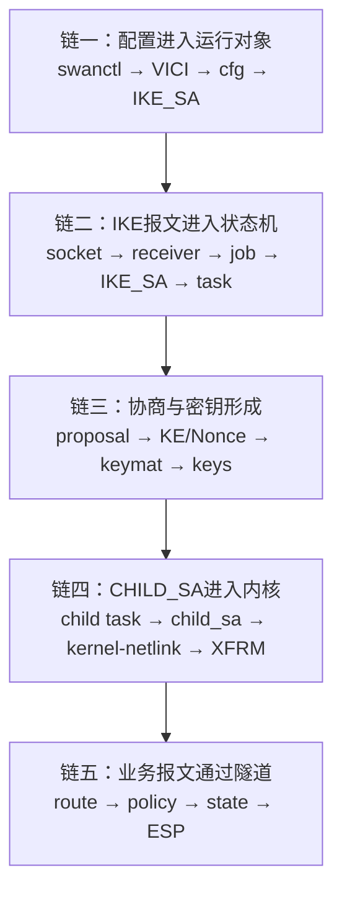
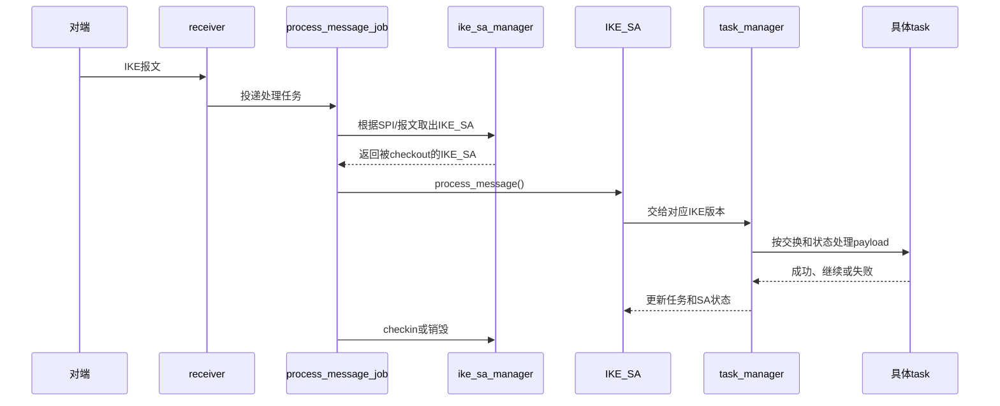
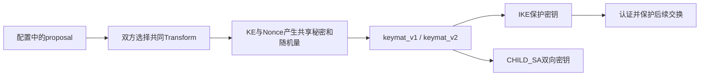
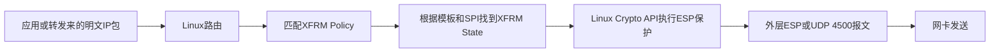

> 适用基线：strongSwan 6.0.3 上游源码，commit `472dcd8bb50a91f156b725ff56992352b573f7dd`<br>
> 学习目标：能够沿真实执行路径定位、解释、修改和验证 strongSwan，而不是通读或背诵整个代码库<br>
> 前置心智模型：[strongSwan设计者视角：对象模型、扩展机制与目录职责](strongSwan%20设计者视角：对象模型、扩展机制与目录职责.md)<br>
> 配套地图：[strongSwan 全链路数据流与模块协作图解](strongSwan%20全链路数据流与模块协作图解.md)
> 配套实验：[strongSwan单虚拟机IKEv2/IPsec配置与验证实操](strongSwan%20单虚拟机%20IKEv2%20IPsec%20配置与验证实操.md)

## 1. 学习目标先定准

strongSwan 有大量平台适配、插件、测试和可选功能。掌握 strongSwan 不等于记住每个目录和函数，也不等于脱离资料重新实现 IKE。

真正需要形成的能力是：

```text
看到配置、日志、PCAP 或故障
→ 判断问题属于配置、IKE控制面、密钥/SA还是内核数据面
→ 找到真实入口和当前运行对象
→ 沿调用链定位关键分支
→ 用日志、报文和系统状态验证判断
→ 完成一个边界清楚的小修改并做回归
```

如果还没有亲手建立过标准IPsec隧道，先完成配套实验，再开始五条链源码精读。实操提供“配置、日志、报文、XFRM和故障”的真实参照物，源码负责解释这些现象怎样产生；二者交替进行，不要先通读完全部源码。

### 1.1 三类学习深度

| 深度 | 内容 | 要求 |
| --- | --- | --- |
| 核心掌握 | IKE_SA、task manager、IKEv1/IKEv2关键任务、keymat、CHILD_SA、kernel-netlink/XFRM | 能定位、解释、修改关键点并诊断代表性故障 |
| 工程会用 | VICI、凭据管理、插件框架、报文编解码、重传、DPD、rekey | 能说明职责并借助搜索进入正确源码 |
| 暂不展开 | 非目标平台后端、全部插件、全部认证方式、kernel-libipsec等可选路线 | 知道用途和查询入口即可 |

### 1.2 不把这些当作掌握

- 看完一篇文档，但不能重新找到源码入口；
- 记住几个函数名，但说不清输入和输出；
- AI给出调用链，却没有核对本地版本；
- IKE日志显示成功，就认为ESP业务流量一定可用；
- 配置里出现某种算法，就认为运行时一定使用了该算法；
- 修改能够编译，却没有确认新产物被实际加载。

## 2. 为什么不能按目录从头读

源码目录表达“代码如何组织”，不直接表达“一次连接如何运行”。如果按文件名逐个阅读，容易积累大量局部知识，却无法回答数据怎样流动。

应采用问题驱动的纵向阅读：


每次只追一条主线，例如：

- 收到一个IKE报文后，程序如何找到对应的IKE_SA？
- IKE proposal怎样从配置字符串变成线上Transform？
- CHILD_SA协商结果怎样安装成XFRM state和policy？

不要把“今天理解整个strongSwan”设为任务，因为它既不可执行，也无法验收。

## 3. 一张稳定的学习地图

学习顺序固定为五条主链。后续遇到新功能，也先判断它挂在哪条链上。



五条链组成最重要的工程闭环：

```text
配置意图 → IKE协议执行 → 密钥和SA结果 → 内核安装 → 真实业务流量
```

### 3.1 五条主链详细入口

不要只记住上图的名词。下面五篇文档分别追踪“输入从哪里来、经过哪些函数、改变了哪个对象、输出被谁继续使用”：

| 主链 | 详细文档 | 读完必须能回答 |
| --- | --- | --- |
| 配置进入运行对象 | [01 配置到 IKE_SA](strongSwan%20五链源码精读%2001%20配置到%20IKE_SA.md) | 一段配置怎样经过swanctl、VICI和配置后端，最终触发一个运行中的IKE_SA？ |
| IKE报文进入状态机 | [02 IKE报文到协议任务](strongSwan%20五链源码精读%2002%20IKE报文到协议任务.md) | UDP包怎样找到IKE_SA，并由task manager交给具体协议任务？ |
| 协商与密钥形成 | [03 Proposal与KE到密钥](strongSwan%20五链源码精读%2003%20Proposal与KE到密钥.md) | proposal、KE、Nonce和SPI分别从哪里来，怎样派生IKE与CHILD密钥？ |
| CHILD_SA进入内核 | [04 CHILD_SA到XFRM](strongSwan%20五链源码精读%2004%20CHILD_SA到XFRM.md) | 双向SPI、密钥和TS怎样变成XFRM state/policy？ |
| 业务报文通过隧道 | [05 业务IP包到ESP](strongSwan%20五链源码精读%2005%20业务IP包到ESP.md) | 明文IP包怎样在内核中匹配策略、加密成ESP并在对端还原？ |

## 4. 开始前的源码定位环境

本地上游基线位于：

```text
/path/to/workspace/learning-sources/strongswan-6.0.3
```

先进入源码根目录：

```bash
cd /path/to/workspace/learning-sources/strongswan-6.0.3
```

`cd`表示切换工作目录。后续相对路径都以这个目录为起点。

查看当前源码版本：

```bash
git rev-parse HEAD
git status --short
```

- 第一条命令输出当前commit，防止文档与源码版本错位；
- 第二条命令确认源码是否被修改；无输出表示工作区干净；
- 学习上游机制时优先使用干净的 `strongswan-6.0.3`，不要与实验改造树混读。

搜索函数定义：

```bash
rg -n "load_conn\(" src/swanctl/commands/load_conns.c
```

- `rg`是快速文本搜索工具；
- `-n`要求显示行号；
- 引号中的内容是搜索模式；
- 最后一个参数限制搜索文件，减少无关结果。

搜索某函数被谁调用：

```bash
rg -n "checkout_by_message\(" src/libcharon
```

查看一小段上下文：

```bash
sed -n '80,150p' src/libcharon/processing/jobs/process_message_job.c
```

`sed -n '80,150p'`只打印第80至150行。不要一开始把整个文件塞进终端或AI上下文。

> **搜索原则**
> 先限定目录或文件，再扩大范围。首先确认定义，其次找调用者，最后才寻找所有同名符号。
>

## 5. 链一：配置怎样进入运行对象

### 5.1 本轮只回答四个问题

1. `swanctl.conf`由谁读取？
2. 配置怎样通过VICI进入charon？
3. 为什么拆成 `ike_cfg`、`peer_cfg`、`child_cfg`？
4. 发起连接时，配置怎样成为运行中的 `IKE_SA`？

### 5.2 最小调用链

```text
swanctl.conf
→ load_conns.c: load_conn()
→ VICI load-conn
→ vici_config.c
→ ike_cfg / peer_cfg / child_cfg
→ controller.c: initiate()
→ ike_sa_manager
→ ike_sa.c
```

### 5.3 第一遍应该读什么

| 文件 | 第一遍只看 | 暂时跳过 |
| --- | --- | --- |
| `src/swanctl/commands/load_conns.c` | `load_conn()`怎样构造VICI请求 | 所有配置选项细节 |
| `src/libcharon/plugins/vici/vici_config.c` | proposal和连接配置怎样形成cfg对象 | 每个回调和校验分支 |
| `src/libcharon/control/controller.c` | `initiate()`怎样取得或创建IKE_SA | 同步/异步控制细节 |
| `src/libcharon/sa/ike_sa.c` | 运行对象持有哪些配置和组件 | 全部方法 |

### 5.4 掌握门槛

不看文档，能够画出配置流，并解释：

- IKE proposal为什么属于 `ike_cfg`；
- 身份认证为什么主要由 `peer_cfg`描述；
- ESP proposal和流量选择器为什么属于 `child_cfg`；
- “配置已成功加载”为什么不等于“IKE连接已经建立”。

## 6. 链二：一个IKE报文怎样进入状态机

### 6.1 最小调用链

```text
UDP 500/4500
→ socket plugin
→ receiver.c
→ process_message_job.c
→ ike_sa_manager.checkout_by_message()
→ ike_sa.process_message()
→ task_manager_v1 / task_manager_v2
→ 当前task.process()
```

### 6.2 重点理解的协作关系



`ike_sa_manager`的checkout/checkin不是协议步骤，而是并发保护：同一个IKE_SA不能被多个工作线程同时任意修改。

### 6.3 必须追一个失败分支

在成功路径以外，选择下面任意一个失败点：

- 报文格式不合法，未进入正常任务；
- 找不到已有SA，需要创建或拒绝；
- 消息ID或交换类型不符合当前状态；
- task返回失败，IKE_SA被销毁。

学习失败分支的目标不是记住错误码，而是知道错误在哪一层被发现、上层如何处理、日志会停在哪里。

### 6.4 掌握门槛

给出一条接收日志或一个IKE包时，能回答：

- 当前运行在哪个线程/任务层；
- SPI怎样关联到IKE_SA；
- IKEv1与IKEv2从哪里开始分叉；
- task manager和具体task分别负责什么。

## 7. 链三：协商怎样产生密钥

这条链不能只读密码函数。必须把“选择算法”“进行密钥交换”“认证身份”“派生方向密钥”分开。



### 7.1 需要明确的边界

- Proposal回答“双方同意用什么”；
- crypto factory和插件回答“具体算法对象由谁实现”；
- keymat回答“按照协议公式怎样从输入派生密钥”；
- authenticator回答“对端身份是否可信”；
- CHILD_SA密钥用于ESP，不等于IKE报文保护密钥。

### 7.2 双路线阅读

| 路线 | 关键目录 | 学习目的 |
| --- | --- | --- |
| 国际IKEv2 | `src/libcharon/sa/ikev2/` | 理解IKE_SA_INIT、IKE_AUTH、CREATE_CHILD_SA及现代主流实现 |
| IKEv1/GM/T对照 | `src/libcharon/sa/ikev1/` | 理解Main/Aggressive、Quick Mode，并对照GM/T 0022识别协议差距 |

这里必须保持结论边界：上游源码分析用于理解原始实现；在IKEv2中增加算法不等于符合GM/T 0022，GM/T 0022的IKEv1 1.1画像、双证书、数字信封和专用keymat需要另行对照。

### 7.3 掌握门槛

能够独立解释：

- Proposal、Transform和算法插件的关系；
- 共享秘密为什么不能直接当作所有会话密钥；
- IKE密钥与CHILD_SA密钥的用途和方向性；
- “插件支持SM4”为什么不能证明ESP已经使用SM4。

## 8. 链四：CHILD_SA怎样安装到Linux

### 8.1 最小调用链

```text
IKEv2 child_create / IKEv1 quick_mode
→ keymat.derive_child_keys()
→ child_sa.install()
→ kernel_interface
→ kernel_netlink_ipsec
→ XFRM_MSG_NEWSA / XFRM_MSG_NEWPOLICY
→ Linux XFRM state / policy
```

### 8.2 阅读时画一张方向表

| 方向 | SPI由谁选择 | 使用哪一侧密钥 | 对应的XFRM对象 |
| --- | --- | --- | --- |
| 本端出站 | 对端提供/协商对应SPI | 本端发送方向密钥 | outbound state与policy |
| 本端入站 | 本端分配对应SPI | 本端接收方向密钥 | inbound state与policy |

不要仅凭表格背诵。阅读 `child_sa.c` 时，要根据本地/远端端点、inbound/outbound参数和SPI实际确认方向。

### 8.3 运行证据

```bash
sudo ip xfrm state
sudo ip xfrm policy
```

- `state`显示SA：SPI、端点、算法和序列号等；
- `policy`显示哪些流量选择器应使用哪条IPsec模板；
- 两者缺一，都可能出现“IKE似乎成功但业务不通”。

### 8.4 掌握门槛

能够从一个CHILD_SA安装失败，区分：

- 协商未产生共同ESP proposal；
- keymat没有正确产生方向密钥；
- 用户态算法名无法映射到内核；
- 内核缺少对应算法；
- state已安装但policy/流量选择器错误。

## 9. 链五：业务包怎样通过隧道

默认 `kernel-netlink + Linux XFRM`路线中，业务包不逐包进入charon。



这条链主要阅读Linux XFRM状态并结合抓包验证，而不是继续在charon里寻找一个不存在的“业务包加密循环”。

### 9.1 掌握门槛

能够解释：

- IKE成功为什么不保证业务流量成功；
- XFRM policy与state分别解决什么问题；
- 公网PCAP为什么一般看不到ESP内层明文和具体密钥；
- 如何用计数器变化、双端日志、XFRM状态和业务结果构成闭环。

## 10. 一个函数只读五件事

第一遍不要逐行解释几百行函数。每个关键函数先完成一张阅读卡：

| 问题 | 记录内容 |
| --- | --- |
| 谁调用它 | 上游文件、函数和触发条件 |
| 输入是什么 | 参数、对象当前状态、关键字段 |
| 修改什么 | 哪个运行对象、状态或队列发生变化 |
| 成功后去哪里 | 下一个函数、产物或系统状态 |
| 失败后怎样 | 返回值、日志、清理和协议表现 |

### 示例：`process_message_job.execute()`

```text
位置：src/libcharon/processing/jobs/process_message_job.c
上游：receiver收到并解析报文后创建job，由processor线程执行
输入：message_t及其IKE header/SPI
核心动作：checkout对应IKE_SA，并调用ike_sa->process_message()
成功输出：IKE_SA和task状态更新，随后checkin
失败输出：SA可能被销毁；日志停在消息处理或具体task层
```

第一遍形成骨架，第二遍才进入锁、枚举器、宏、内存所有权和异常分支。

## 11. 每次源码学习的固定闭环


### 11.1 60至90分钟学习节奏

| 时间 | 动作 | 产出 |
| --- | --- | --- |
| 10分钟 | 不看文档复述今天所在线路 | 一张粗略流程图 |
| 10分钟 | 明确一个问题并定位入口 | 文件、函数、触发条件 |
| 25分钟 | 追一条成功链 | 5至8个关键节点 |
| 15分钟 | 追一个失败分支 | 发现位置、返回方式、日志表现 |
| 10分钟 | 填函数阅读卡 | 输入、状态变化、输出 |
| 10分钟 | 对应运行证据 | 日志/PCAP/XFRM中的观察点 |
| 10分钟 | 脱离资料讲解 | 暴露尚未理解的断点 |

时间不是考核指标；如果成功链尚未闭合，不要为了“完成章节”强行进入下一条链。

### 11.2 代表性实操原则

每个重要机制至少完成一次：

1. 手工定位一条端到端路径；
2. 阅读一个核心对象和一个关键分支；
3. 增加一条可辨识日志或做一个小修改；
4. 制造一个可恢复失败；
5. 用原始日志、PCAP或XFRM状态确认代码确实运行。

之后的机械搜索、重复提取和文档整理可以交给AI，提高速度。

## 12. 如何让AI帮忙而不被AI带着走

### 12.1 适合交给AI

- 搜索候选文件和函数；
- 生成初步调用链；
- 比较两个版本的diff；
- 解释结构体字段和C语言写法；
- 整理日志、PCAP字段和阅读卡；
- 生成小型故障注入或回归脚本。

### 12.2 必须由学习者确认

- 分析的是不是当前基线和实际编译路径；
- 候选函数是否真的在运行时被调用；
- AI有没有把IKEv1、IKEv2或可选插件混在一起；
- 修改后的二进制是否真正部署；
- 日志、PCAP和XFRM状态是否共同支持结论；
- 结论是否越过了现有证据边界。

### 12.3 推荐提问格式

```text
基线：strongSwan 6.0.3，上游commit 472dcd8...
问题：收到IKE_SA_INIT后，报文怎样找到或创建IKE_SA？
范围：receiver → process_message_job → ike_sa_manager → ike_sa
要求：列出真实函数、输入输出、成功路径、一个失败分支；
      对每个结论给出源码位置，不扩展到密码算法细节。
```

问题范围越清楚，AI越不容易给出“看似完整但无法验证”的大段答案。

## 13. 掌握度不是“看完”，而是五级门槛

| 级别 | 能力表现 | 是否算掌握 |
| --- | --- | --- |
| L1 识别 | 看图能认出模块名和大致职责 | 否 |
| L2 重定位 | 能用搜索重新找到入口、核心对象和下游 | 初步 |
| L3 解释 | 能说清输入、状态变化、输出和失败行为 | 基本掌握 |
| L4 验证 | 能把源码对应到日志、PCAP和系统状态 | 工程掌握 |
| L5 修改 | 能完成边界明确的修改、负面测试和回归 | 可承担该切片 |

学习目标不是所有模块同时达到L5。优先让五条主链达到L3至L4，再选择公司真正需要负责的切片进入L5。

## 14. 推荐的十次源码学习安排

| 次序 | 唯一核心问题 | 主要源码 | 达标产出 |
| --- | --- | --- | --- |
| 1 | 配置如何形成三个cfg对象 | `load_conns.c`、`vici_config.c` | 配置流图和三对象职责 |
| 2 | 发起连接如何创建/取得IKE_SA | `controller.c`、`ike_sa_manager.c`、`ike_sa.c` | 入口到运行对象调用链 |
| 3 | 收到报文后如何找到IKE_SA | `receiver.c`、`process_message_job.c` | 接收路径及一个失败分支 |
| 4 | task manager怎样驱动交换 | `task_manager_v1.c`、`task_manager_v2.c` | 公共职责与版本分叉图 |
| 5 | Proposal怎样被解析和选择 | `proposal.c`、proposal payload相关文件 | 配置token到Transform图 |
| 6 | IKEv2密钥怎样形成 | `ike_init.c`、`ike_auth.c`、`keymat_v2.c` | 输入、派生物和用途表 |
| 7 | IKEv1密钥与模式怎样形成 | Main/Aggressive、`keymat_v1.c` | 上游IKEv1主链 |
| 8 | GM/T 0022相对上游差在哪里 | IKEv1相关文件 + 标准差距文档 | 不混淆算法扩展和协议画像改造 |
| 9 | CHILD_SA怎样安装进内核 | `child_sa.c`、`kernel_interface.c`、`kernel_netlink_ipsec.c` | Netlink/XFRM安装链 |
| 10 | 业务包为什么能通或不通 | XFRM状态、日志和PCAP | 控制面到数据面验证闭环 |

这十次是学习顺序，不是十天硬性进度。已经掌握的部分可以通过口述和定位测试快速跳过。

## 15. 每次学习记录模板

```markdown
# 本次问题

## 我先画出的流程

## 源码基线
- 版本/commit：
- 工作区是否干净：

## 成功调用链
1. 文件:函数 — 输入 — 核心动作 — 输出

## 一个失败分支
- 触发条件：
- 被谁发现：
- 返回/清理：
- 日志或报文表现：

## 函数阅读卡
- 谁调用：
- 输入：
- 修改的对象/状态：
- 成功下游：
- 失败行为：

## 运行对应
- 日志：
- PCAP：
- XFRM/系统状态：

## 我能否脱离文档讲清楚
- [ ] 能重新找到入口
- [ ] 能解释输入和输出
- [ ] 能解释一个失败分支
- [ ] 能用运行证据验证
- [ ] 能完成一个小修改或故障注入

## 尚未闭合的问题
```

## 16. 最终能力验收

完成这一阶段时，不以阅读页数和函数数量验收，而进行一次综合题：

> 给出一份连接配置、一段charon日志、一个IKE PCAP和两端 `ip xfrm` 输出，判断连接停在哪一层，并定位到对应源码模块。

需要独立完成：

1. 从配置指出IKE与ESP proposal、认证和流量选择器；
2. 从PCAP判断当前交换、方向、SPI和协商结果；
3. 从日志定位task及失败层次；
4. 从XFRM判断CHILD_SA是否正确安装；
5. 回到源码说明发现错误的函数边界；
6. 提出一个小修改或负面测试；
7. 说明结论已经证明什么、仍不能证明什么。

达到这个标准，才意味着你开始拥有strongSwan的工程控制力，而不只是“看过strongSwan源码”。

## 17. 关联文档

| 文档 | 用法 |
| --- | --- |
| [strongSwan 源码导览](strongSwan%20源码导览.md) | 查目录、结构体、关键函数和扩展层 |
| [strongSwan 全链路数据流与模块协作图解](strongSwan%20全链路数据流与模块协作图解.md) | 每次学习前确认自己位于哪条数据流 |
| [strongSwan 6.0.3 总体框架与关键调用流程](strongSwan%206.0.3%20总体框架与关键调用流程.md) | 需要展开完整架构和调用关系时查阅 |
| [strongSwan IKEv2 状态机与密钥生命周期源码精读](strongSwan%20IKEv2%20状态机与密钥生命周期源码精读.md) | 深入IKEv2控制面与密钥阶段 |
| [GM/T 0022—2023 与 strongSwan 6.0.3 上游差距分析](GM-T%200022-2023%20与%20strongSwan%206.0.3%20上游差距分析.md) | 对照上游IKEv1与GM/T协议要求，避免把替换算法误当完整国密化 |
