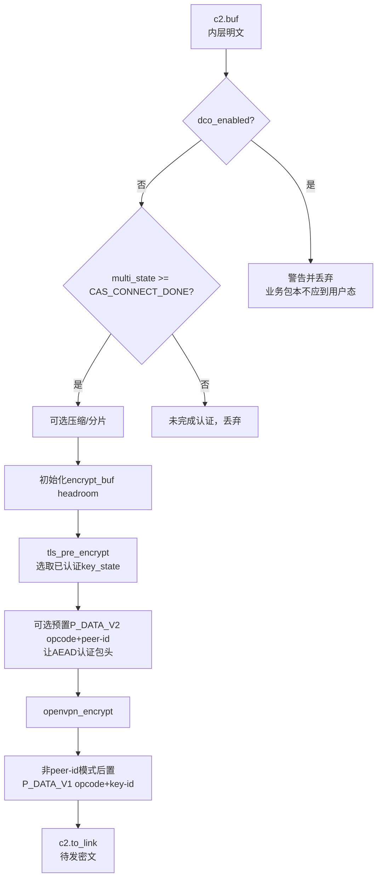

> 源码基线：OpenVPN 2.7.4 上游，官方 tag `v2.7.4` 对应提交 `8e9e91f`  
> 本文跟踪用户态数据通道：一个内层 IP 包从 TUN 被读出后，如何选择密钥、生成 packet-id/IV、加密与认证，再通过 UDP/TCP socket 发出。  
> 边界：启用 DCO 时，正常业务包不走本文的用户态逐包加密链。  
> 上一条链：[TLS 握手到数据通道密钥](OpenVPN%20六链源码精读%2003%20TLS握手到数据通道密钥.md) · 下一条链：[外层报文到 TUN 明文](OpenVPN%20六链源码精读%2005%20外层报文到TUN明文.md)

## 1. 先看整条链


这条链里不应出现 TLS 证书签名的逐包调用。证书签名用于控制通道身份认证；业务数据包使用握手后已安装的对称 key。

## 2. 输入从哪里来：TUN 是内层包的交界面

TUN 虚拟网卡对操作系统看起来像一块网卡。当路由表决定某个 IP 包应走 VPN，内核将它放入 TUN 队列，OpenVPN 从 TUN fd 读出。

```text
应用发出 10.0.0.2 → 10.20.0.10 的TCP包
→ 路由命中VPN虚拟接口
→ TUN fd可读
→ OpenVPN获得一个完整内层IP包
```

TAP 模式则可能提供二层以太帧。下文以更常见的 TUN/IP 语义讲解，但 buffer 转发骨架是相通的。

## 3. 事件循环怎样进入发送链

`forward.c:2287 process_io()` 在 `TUN_READ` 分支执行：

```text
read_incoming_tun(c)
→ process_incoming_tun(c, sock)
```

### 3.1 `read_incoming_tun()` 的输入和输出

`forward.c:1300 read_incoming_tun()`：

1. 将 `c->c2.buf` 指向预分配的 `read_tun_buf`；
2. 保留 `frame.buf.headroom`，为后面前置包头留空间；
3. 调用平台 TUN 读函数；
4. 把返回长度写入 `c->c2.buf.len`；
5. 区分正常读包、TUN 停止、I/O 取消和普通错误。

此时 `c->c2.buf` 中是内层明文，还没有 OpenVPN opcode，也没有数据通道 tag/HMAC。

## 4. `process_incoming_tun()` 为什么不立即加密

`forward.c:1479 process_incoming_tun()` 先执行与包路径安全和 MTU 有关的预处理：

- 增加 TUN 读字节计数；
- 可选检测“发给 VPN 服务端外层地址的包反而被路由进 TUN”的递归路由；
- `process_ip_header()` 处理 TOS、MSS 修正、client NAT 等需要观察内层 IP 头的功能；
- 可选做加密前包长一致性检查；
- 最后才调用 `encrypt_sign(c, true)`。

原因是：加密后就无法直接查看内层 TCP/IP 头并修改 MSS 等字段。

## 5. `encrypt_sign()` 是发送方向的总编排点

`forward.c:621 encrypt_sign()` 的函数注释明确写出：

```text
Input:  c->c2.buf
Output: c->c2.to_link
```

它的主要顺序是：



### 5.1 为什么 DCO 分支会直接丢包

`forward.c:627-632` 在 DCO 启用时对进入该函数的数据包告警并清零。这不是“DCO 不能发包”，而是说正常 DCO 业务包应走内核路径，不应又回到用户态这条链。

### 5.2 为什么还要检查 `CAS_CONNECT_DONE`

TLS 底层可能已经生成某些 key，但客户连接脚本、用户认证或配置 PUSH 还未完成。`multi_state` 门禁防止业务流量在整个客户连接流程真正完成前通过。

## 6. `tls_pre_encrypt()` 怎样选出这一包的 key

`ssl.c:3917 tls_select_encryption_key()` 扫描可用 key state，要求：

```text
ks->state >= S_GENERATED_KEYS
且 ks->authenticated == KS_AUTH_TRUE
且 ks->crypto_options.key_ctx_bi.initialized
```

`ssl.c:3944 tls_pre_encrypt()` 将选中 key state 的：

```c
*opt = &ks_select->crypto_options;
multi->save_ks = ks_select;
```

前者交给 `openvpn_encrypt()`，后者用于后续写入正确 key-id 的 opcode。如果找不到可用 key，函数会将 `buf->len = 0`，而不是明文发出。

## 7. `openvpn_encrypt()` 的 AEAD 与非 AEAD 分支

`crypto.c:329 openvpn_encrypt()` 根据已初始化的发送 cipher context 分流：

```text
cipher_ctx_mode_aead(encrypt.cipher)
    → openvpn_encrypt_aead()
否则
    → openvpn_encrypt_v1()
```

### 7.1 AEAD 路径

`crypto.c:65 openvpn_encrypt_aead()` 的逻辑是：


决定性安全点：

- packet-id 参与每包 IV 构造，回卷时会报错丢包；
- `cipher_ctx_update_ad()` 将不加密但必须防篡改的头部纳入 AAD；
- 最终 tag 由 `cipher_ctx_get_tag()` 获取；
- 任何 buffer/crypto 错误将 `buf->len = 0`，不会发出半成品。

### 7.2 CBC/CFB/OFB 兼容路径

`crypto.c:197 openvpn_encrypt_v1()` 处理非 AEAD 模式。以 CBC + HMAC 为例：

```text
为HMAC预留空间
→ 生成随机IV
→ 将packet-id放入待加密明文
→ cipher加密
→ 对IV+密文做HMAC
→ 输出HMAC || IV || ciphertext
```

从源码 `303-308` 可看到 HMAC 覆盖 `hmac_start` 到工作 buffer 末尾，即对密文路径做认证。这与 AEAD 的 tag/AAD 布局不同，不能只替换 cipher 名字就忽略包格式和验证顺序。

## 8. opcode/key-id/peer-id 什么时候加入

`encrypt_sign()` 对 P_DATA_V2 和 P_DATA_V1 的处理时机不同：

- P_DATA_V2 且使用 peer-id：在 `openvpn_encrypt()` 前将 1 字节 opcode/key-id 与 3 字节 peer-id 写入工作 buffer，从而 AEAD 可将它纳入 AAD；
- 非 peer-id 的 P_DATA_V1：在加密后通过 `tls_prepend_opcode_v1()` 前置 opcode/key-id。

所以研究“包头是否被认证”时，必须同时看 packet format 和 `openvpn_encrypt_aead()` 的 AAD 输入，不能只看 Wireshark 显示了哪个字段。

## 9. 密文怎样真正发出

`encrypt_sign()` 完成后，使用 `buffer_turnover()` 将输出转为 `c->c2.to_link`，并设置对端外层地址。

`forward.c:1746 process_outgoing_link()` 然后：

1. 检查 `to_link.len` 不超过 frame payload size；
2. 更新 shaper/ping 状态；
3. 可选加 SOCKS5 UDP 包头；
4. `link_socket_write()` 调用平台 socket API；
5. 更新发送字节计数；
6. 检查截断、网络不可达等错误；
7. 重置 `to_link` 等待下一包。

公网网卡抓包看到的是外层 IP + UDP/TCP + OpenVPN 包；内层业务 IP 头与 payload 已在 OpenVPN 数据密文内。

## 10. 发送链的 buffer 变化表

| 位置 | buffer | 数据形态 | 下一个消费者 |
| --- | --- | --- | --- |
| TUN 读完 | `c2.buf` | 内层 IP 明文 | `process_incoming_tun()` |
| IP 预处理后 | `c2.buf` | 可能调整 MSS/TOS 的明文 | `encrypt_sign()` |
| key 选择后 | `crypto_options *co` | 当前发送密钥上下文 | `openvpn_encrypt()` |
| 加密后 | `c2.buf`/`encrypt_buf` | packet-id/IV + ciphertext + tag/HMAC | opcode 处理 |
| 转移后 | `c2.to_link` | 完整 OpenVPN 数据包 | `process_outgoing_link()` |
| socket 写入 | 内核 socket buffer | 外层 UDP/TCP payload | IP 网络 |

## 11. SM4 数据通道改造要真正检查的位置

### SM4-GCM/其他 AEAD 模式

- `cipher_valid()` 和 `cipher_kt_mode_aead()` 是否识别并分流到 AEAD；
- `cipher_ctx_iv_length()` 与 implicit IV 长度是否正确；
- packet-id 与 IV/nonce 组合是否保证唯一性；
- AAD 是否覆盖必要包头；
- tag 长度、位置与对端一致；
- 重协商/轮换后 nonce 空间是否重置到新 key 域。

### SM4-CBC + HMAC-SM3 模式

- cipher backend 是否返回 CBC 模式和正确块大小；
- 每包 IV 是否随机且长度正确；
- packet-id 是否放在加密内容中；
- HMAC-SM3 是否覆盖正确的 IV + ciphertext 范围；
- tag/HMAC 截断长度两端是否完全一致；
- 接收端是否先验 HMAC 再释放解密明文。

## 12. 证明这条链真正成立的证据

| 证据 | 能证明 | 不能单独证明 |
| --- | --- | --- |
| TUN 上的明文业务包 | 操作系统将业务包送入隧道 | 外层真的用了某个 cipher |
| `Data Channel: cipher ...`/运行密码上下文日志 | 选中与初始化的 cipher | 密码库调用一定无 bug |
| 外层 PCAP 中有 P_DATA 且内容不可读 | 业务包已封装成 OpenVPN 数据包 | 密文所用具体算法（PCAP通常不自带算法名） |
| 错误数据 key 导致对端拒绝 | 数据包验证与该 key 绑定 | 控制通道算法与数据算法相同 |

## 13. 跟读练习

用纸记录一个包在五个时刻的状态：

1. `read_incoming_tun()` 返回后；
2. `tls_pre_encrypt()` 返回后；
3. `openvpn_encrypt_aead()` 刚写完 packet-id/AAD 后；
4. 刚写完 tag 后；
5. `link_socket_write()` 调用前。

每个时刻只回答：buffer 名、明文/密文、前置头部、当前 key 来源、下一个函数。

## 14. 掌握检查

1. TUN 为什么会收到应用的 IP 包？
2. `process_incoming_tun()` 为什么要在加密前处理 IP 头？
3. `tls_pre_encrypt()` 选 key 时检查哪几个状态？
4. AEAD 模式的 packet-id、IV、AAD 和 tag 各自做什么？
5. 为什么外层 PCAP 看到“密文”仍不能单独证明它是 SM4？
