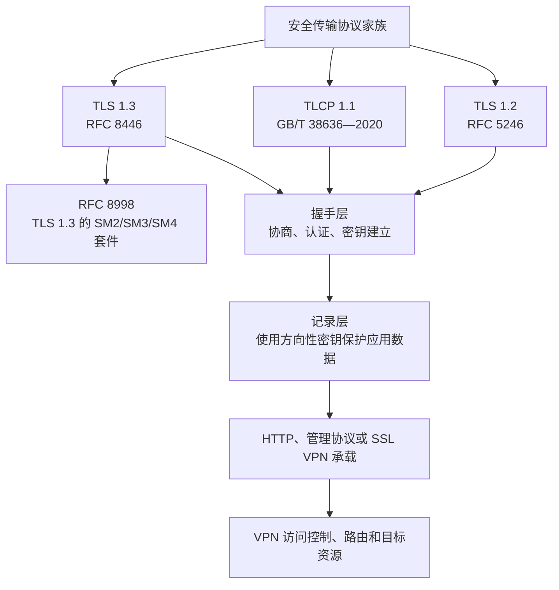
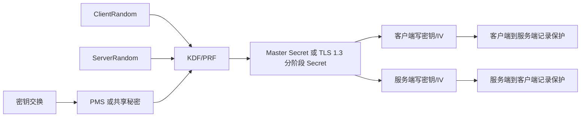
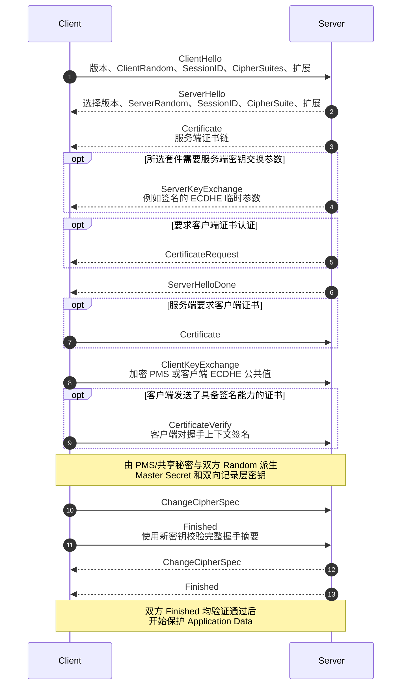
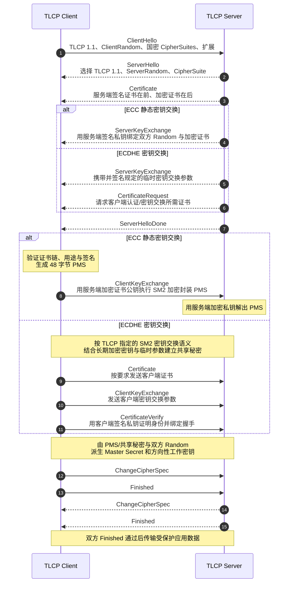
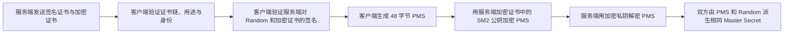
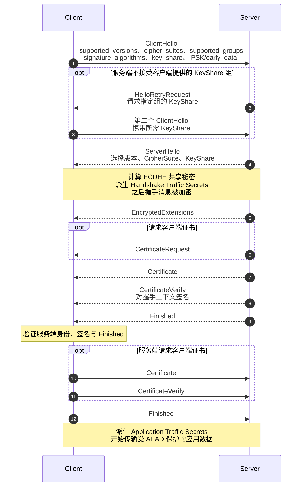
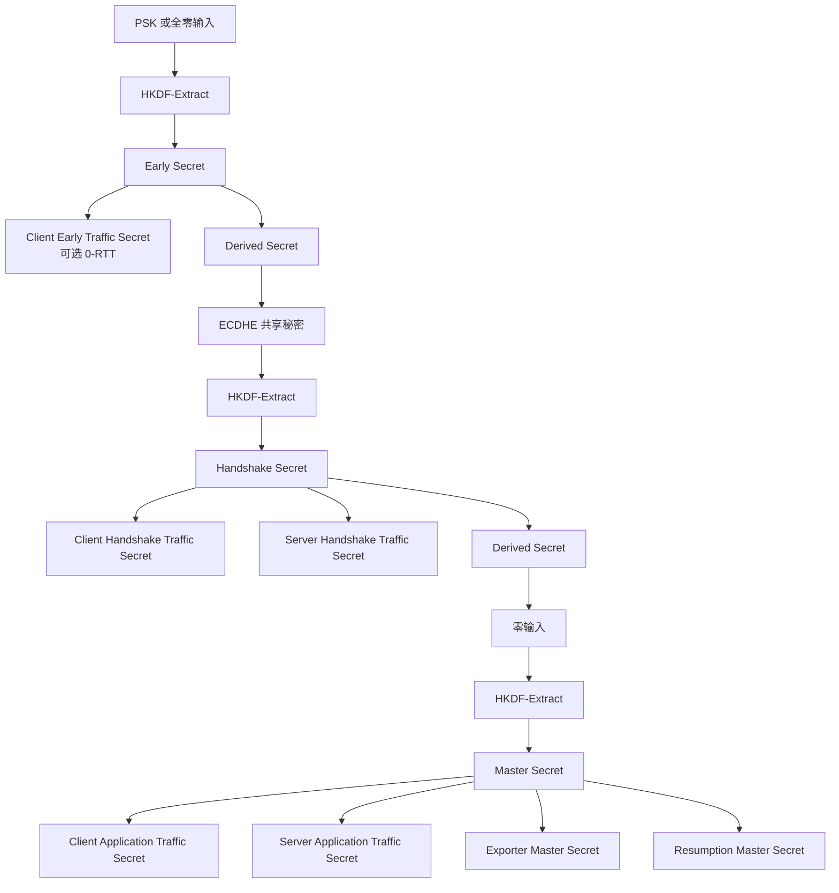
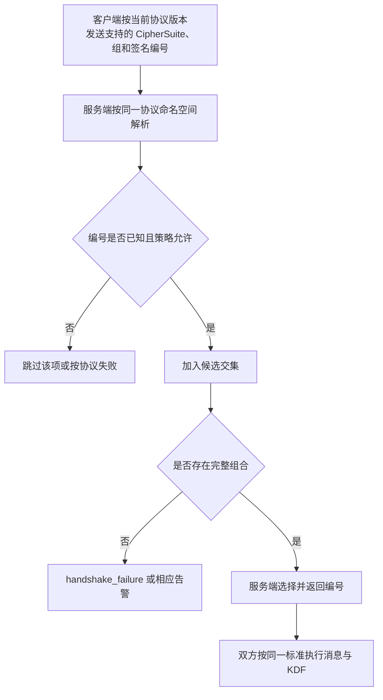
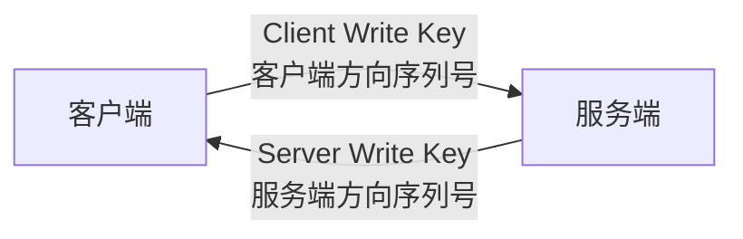
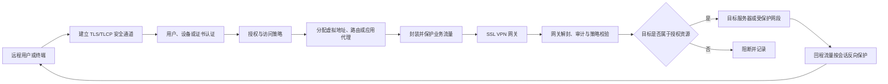

> 文档版本：V1.0  
> 编制日期：2026-09-18  
> 适用对象：研发、测试、技术支持、项目实施与验收人员  
> 阅读说明：本文中的流程图使用 Mermaid 语法，需在支持 Mermaid 的 Markdown 阅读器中查看。

## 1. 文档目的与适用范围

本文从工程实现和验收角度解读 TLS 1.2、TLCP、TLS 1.3 及 RFC 8998 国密套件，说明各自的握手过程、证书模型、密钥建立、密钥派生、记录层保护、算法编号和 VPN 工程边界。

本文重点回答以下问题：

- TLS、TLCP、RFC 8998 之间是什么关系；
- 签名证书和加密证书分别解决什么问题；
- TLS 1.2、TLCP 和 TLS 1.3 的消息流程有何不同；
- 静态密钥交换、临时 ECDHE 和 TLCP SM2 密钥交换如何得到共享秘密；
- CipherSuite 编号为什么不能跨协议互换；
- 支持 TLCP 为什么不等于已经实现完整 SSL VPN；
- 代码、抓包、测试和业务流量如何形成验收证据。

> 合规声明：本文是工程解读，不替代标准原文。实现和验收时，应以采购文件指定版本、正式标准文本、主管部门要求和双方确认的协议配置文件为准。

## 2. 一页结论

1. **TLS 1.2、TLS 1.3 和 TLCP 是不同的线上协议配置。** 它们不能仅凭算法名称相同而互通。
2. **TLCP 不是“TLS 1.2 把 AES 换成 SM4”。** 它定义了 TLCP 1.1 版本语义、双证书、国密套件和专用密钥交换行为。
3. **RFC 8998 也不是 TLCP。** RFC 8998 将 SM2、SM3、SM4 放入 TLS 1.3 框架，仍采用 TLS 1.3 的消息结构、HKDF 密钥树和 ECDHE 语义。
4. **签名证书主要证明身份和握手完整性。** 加密证书用于静态密钥传输或 TLCP 密钥交换中的加密/密钥建立，二者不能随意混用。
5. **握手的任务不是传输业务数据。** 握手先认证并建立方向性密钥，记录层再用这些密钥保护应用数据。
6. **TLS/TLCP 成功不等于 SSL VPN 完整。** VPN 还需要用户/设备认证、授权、虚拟网卡或代理、路由、受保护网段、会话管理和数据面强制执行。
7. **线上算法编号带有命名空间。** `TLCP 0xE053` 与 `TLS 1.3 0x00C6` 即使都涉及 SM4-GCM/SM3，也不是同一套件编号。

## 3. 协议家族与层次关系



应把四个层次分开判断：

| 层次 | 典型问题 | 不能被什么替代 |
|---|---|---|
| 密码算法 | 是否实现 SM2/SM3/SM4、AES、SHA 等 | 算法存在不能证明协议兼容 |
| 协议实现 | 消息格式、状态机、KDF、证书、编号是否匹配 | 握手函数调用不能证明线上语义正确 |
| 安全通道 | 握手后记录层能否双向保护应用数据 | 仅握手抓包不能证明数据传输 |
| VPN 能力 | 是否完成认证、授权、路由、隧道和目标访问 | 支持 TLS/TLCP 不能证明完整 SSL VPN |

## 4. 基础概念

### 4.1 签名证书与加密证书

| 证书类型 | 私钥的典型用途 | 证明或实现的能力 | 不能单独证明什么 |
|---|---|---|---|
| 签名证书 | 对握手摘要、参数或认证数据签名 | 私钥持有者身份、握手参数未被篡改 | 不能仅凭证书存在证明业务数据已加密 |
| 加密证书 | 解密 PMS/密钥材料，或参与规定的密钥交换 | 只有对应私钥持有者能取得或建立秘密 | 不能替代签名证书完成身份签名 |

“签名证书证明他是他”还需要完整条件：证书链可信、证书在有效期内、用途允许、身份与访问目标匹配、私钥持有证明成功，并根据项目要求完成吊销状态检查。

TLCP 服务端通常发送两张证书：签名证书在前、加密证书在后。客户端是否必须发送双证书取决于所选套件、是否启用客户端认证以及具体产品/项目配置。

### 4.2 Random、PMS、Master Secret、工作密钥和 IV



| 名称 | 作用 |
|---|---|
| ClientRandom / ServerRandom | 提供会话新鲜性并参与密钥派生；不是加密密钥 |
| PMS（预主密钥）或 ECDHE 共享秘密 | 握手中建立的高价值秘密输入 |
| Master Secret | TLS 1.2/TLCP 风格 KDF 的核心中间秘密 |
| Traffic/Write Key | 真正保护记录层数据的方向性对称密钥 |
| IV/Nonce | 保证加密模式对同一密钥下不同记录的输入不同；通常无需保密，但必须满足唯一性/不可预测性要求 |
| Record Sequence Number | 参与 MAC、AAD 或 Nonce 构造，用于顺序和完整性保护；通常不在线上显式传输 |

## 5. TLS 1.2

### 5.1 完整握手流程



星号消息是条件消息，是否出现取决于密钥交换算法、客户端认证要求和会话恢复路径。

### 5.2 两种典型密钥建立路径

#### 静态 RSA 密钥传输

1. 客户端生成 48 字节 PMS；
2. 客户端用服务端证书中的 RSA 加密公钥加密 PMS；
3. 服务端用对应私钥解密 PMS；
4. 双方由 PMS 和 Random 派生相同的 Master Secret。

这一路径不能提供前向保密：服务端长期私钥未来泄露时，历史抓包中的 PMS 可能被恢复。因此 TLS 1.3 已删除静态 RSA 密钥传输。

#### ECDHE 临时密钥交换

1. 服务端生成临时椭圆曲线密钥对，并用证书私钥对临时参数和握手上下文签名；
2. 客户端验证签名，生成自己的临时密钥对；
3. 双方交换临时公共值，分别计算同一个 ECDH 共享秘密；
4. 共享秘密作为 PMS 等价输入进入 KDF；
5. 临时私钥在使用后安全删除，从而获得前向保密。

ECDHE 的数学计算负责建立共同秘密，证书签名负责把这个临时交换绑定到可信身份；二者缺一不可。

### 5.3 TLS 1.2 密钥派生

```text
master_secret = PRF(
    pre_master_secret,
    "master secret",
    ClientHello.random | ServerHello.random
)[0..47]

key_block = PRF(
    master_secret,
    "key expansion",
    ServerHello.random | ClientHello.random
)
```

注意两个种子的 Random 顺序相反。`key_block` 再按套件定义切分为客户端/服务端 MAC 密钥、写加密密钥和 IV 等材料。GCM 等 AEAD 套件不再需要独立 MAC 密钥。

### 5.4 Finished 的意义

Finished 不只是“通知完成”。它利用新建立的密钥对此前握手消息的摘要进行校验，从而证明：

- 双方获得了同一组握手秘密；
- 双方看见的握手消息和协商参数一致；
- 中间人没有在未被发现的情况下篡改协商过程。

Finished 成功仍只证明安全通道已建立，不证明上层用户有权访问任意 VPN 资源。

## 6. TLCP 1.1

### 6.1 协议定位

TLCP 由 GB/T 38636—2020 规定，使用国密算法，并对双证书、套件、密钥交换和记录保护作出专门规定。其握手外形与传统 TLS/SSL 有相似之处，但不是 TLS 1.2 的一个普通 CipherSuite 插件。

本文重点列出四个常见套件：

| TLCP CipherSuite | 编号 | 密钥交换/认证 | 记录保护 |
|---|---:|---|---|
| `ECDHE_SM4_CBC_SM3` | `0xE011` | TLCP ECDHE/SM2 语义 | SM4-CBC + SM3 |
| `ECC_SM4_CBC_SM3` | `0xE013` | 静态 ECC/SM2 语义 | SM4-CBC + SM3 |
| `ECDHE_SM4_GCM_SM3` | `0xE051` | TLCP ECDHE/SM2 语义 | SM4-GCM |
| `ECC_SM4_GCM_SM3` | `0xE053` | 静态 ECC/SM2 语义 | SM4-GCM |

### 6.2 TLCP 完整握手



> 图中为便于比较，将分支的关键消息集中展示。实际消息顺序、条件消息和字段编码必须严格按 GB/T 38636—2020 及项目配置执行。

### 6.3 静态 ECC 路径

静态 ECC 路径的逻辑与“客户端生成 PMS、服务端私钥解密”一致：



签名证书用于防止攻击者把自己的加密公钥替换进握手；加密证书用于保护 PMS。只校验证书链而不校验签名绑定关系是不完整的。

### 6.4 ECDHE/SM2 密钥交换路径

TLCP 的 ECDHE 套件不能简单理解为“国际 TLS ECDHE 换一条 SM2 曲线”。应按 GB/T 38636 引用的 SM2 密钥交换语义处理长期加密密钥、临时密钥、身份参数和共享秘密计算。

这一设计的工程重点包括：

- 长期签名密钥只用于签名，不得与加密/密钥交换私钥混用；
- 客户端和服务端正确选择各自的加密证书与私钥；
- 临时密钥必须由合格随机源生成，并在使用后安全清除；
- 双方身份值、曲线参数、公共点校验和 KDF 输入必须完全一致；
- 是否提供前向保密，取决于所用临时秘密是否真正参与共享秘密、是否未被长期密钥单独恢复以及是否在使用后删除。

### 6.5 TLCP 密钥派生与记录保护

TLCP 使用类似 TLS 1.2 的“PMS → Master Secret → Key Block”层次，但 PRF、摘要和套件语义按 TLCP 规定执行：

```text
PMS / SM2 共享秘密
        ↓ 结合 ClientRandom、ServerRandom
Master Secret
        ↓ 反向 Random 顺序扩展
Client/Server MAC Key、Write Key、IV 等方向性材料
```

CBC 套件需要分别处理加密与消息认证，并严格遵守记录层填充、MAC 和错误处理要求；GCM 套件用 AEAD 同时提供机密性与完整性，关键是保证同一密钥下 Nonce 唯一，并按标准构造 AAD 和认证标签。

## 7. TLS 1.3

### 7.1 完整握手流程

TLS 1.3 删除了静态 RSA、静态 DH、`ServerHelloDone`、传统 `ServerKeyExchange` 和 `ClientKeyExchange`，将密钥协商参数放入扩展，并在 `ServerHello` 之后尽早加密握手消息。



### 7.2 TLS 1.3 密钥树



TLS 1.3 的不同阶段使用不同 Traffic Secret，降低了一把长期会话密钥覆盖所有阶段的风险。应用数据密钥还能通过 `KeyUpdate` 更新。

### 7.3 TLS 1.3 相对 TLS 1.2 的改进

| 维度 | TLS 1.2 | TLS 1.3 |
|---|---|---|
| 往返次数 | 完整握手通常 2-RTT | 通常 1-RTT；恢复可选 0-RTT |
| 密钥交换 | 可包含静态 RSA、静态 DH、ECDHE | 普通证书握手要求前向安全的 (EC)DHE；可结合 PSK |
| 记录算法 | 可使用 CBC、AEAD | 仅允许 AEAD |
| 密钥派生 | 单一 PRF 风格 Master Secret/Key Block | HKDF 分阶段密钥树 |
| 握手隐私 | 多数服务端握手消息明文 | ServerHello 后的主要握手消息加密 |
| CipherSuite 含义 | 通常捆绑密钥交换、认证、加密、MAC | 仅选择 AEAD 与 Hash；签名算法和密钥交换组独立协商 |

0-RTT 数据不具备普通 1-RTT 数据同等级别的抗重放保证。只有上层业务明确允许重复、且服务端部署了相应抗重放措施时才应启用。

## 8. RFC 8998：TLS 1.3 国密套件

RFC 8998 把中国商用密码算法放入 TLS 1.3 框架，核心注册值包括：

| 类型 | 名称 | 线上编号 |
|---|---|---:|
| TLS 1.3 CipherSuite | `TLS_SM4_GCM_SM3` | `0x00C6` |
| TLS 1.3 CipherSuite | `TLS_SM4_CCM_SM3` | `0x00C7` |
| SignatureScheme | `sm2sig_sm3` | `0x0708` |
| Supported Group | `curveSM2` | `41` |

RFC 8998 的关键语义：

- 使用 TLS 1.3 的消息结构和 HKDF 密钥树；
- CipherSuite 只选择 SM4 AEAD 模式与 SM3 哈希；
- 签名算法通过 `signature_algorithms` 独立协商；
- 密钥交换组通过 `supported_groups`/`key_share` 独立协商；
- 在 `curveSM2` 上执行 TLS 1.3 所要求的 ECDHE，而不是直接使用 SM2 专用密钥交换协议；
- 证书模型遵循 TLS 1.3 的签名认证逻辑，不采用 TLCP 的服务端双证书消息语义。

因此，下列等式是错误的：

```text
RFC 8998 ≠ TLCP
TLS_SM4_GCM_SM3(0x00C6) ≠ ECC_SM4_GCM_SM3(0xE053)
```

## 9. 算法编号与协商

### 9.1 为什么双方“先天知道”编号

客户端和服务端在软件实现、标准配置或项目部署阶段已经各自装入算法映射表。握手时交换的是编号和参数，不会在线解释“这个新编号代表什么”。在线协商只能选择双方已知集合的交集。



### 9.2 协议间编号不能互换

| 协议 | 编号的含义 |
|---|---|
| TLS 1.2/TLCP 风格 CipherSuite | 往往同时表达密钥交换、身份认证、记录加密与摘要/MAC |
| TLS 1.3 CipherSuite | 只表达 AEAD 与 HKDF 使用的 Hash |
| TLS 1.3 SignatureScheme | 独立表达签名算法和相关参数 |
| TLS 1.3 Supported Group | 独立表达 ECDHE 群/曲线 |

代码应至少维护“协议版本 + 字段类型 + 编号 → 内部算法对象”的映射，而不是全局维护一个 `0xXXXX → 算法名` 表。

## 10. 记录层数据保护

### 10.1 方向性密钥

无论 TLS、TLCP 还是 TLS 1.3，客户端到服务端和服务端到客户端都使用不同的写密钥/Traffic Secret。这里的“双向安全通道”不代表两个方向共用同一把对称密钥。



### 10.2 CBC 与 AEAD

| 机制 | 保护方式 | 主要风险控制 |
|---|---|---|
| TLS 1.2/TLCP CBC | 按相应标准执行 MAC、填充和块加密 | 统一错误行为、常数时间校验、防止填充侧信道、正确 IV |
| GCM/CCM AEAD | 一次运算完成加密和认证 | Nonce 唯一、AAD 正确、Tag 必须先验证、失败不得输出明文 |
| TLS 1.3 AEAD | 由 Traffic Key、Traffic IV 与记录序列号构造保护 | 序列号/Nonce 管理、KeyUpdate、阶段密钥隔离 |

记录层认证失败时必须丢弃该记录，不得把未经认证的明文交给上层。

## 11. 从 TLS/TLCP 到完整 SSL VPN

### 11.1 完整数据路径



### 11.2 协议能力与产品能力的边界

仅支持 TLS/TLCP 握手，不能证明以下 VPN 能力已经实现：

- 用户、终端、证书和多因素认证；
- 账号、角色、应用和网段级授权；
- 全隧道、分流、应用代理或 Web 门户；
- 虚拟网卡、虚拟地址、DNS 和路由下发；
- 完整 IP 包或指定应用协议的双向承载；
- 会话并发、超时、断线重连、注销和密钥更新；
- 网关到目标资源的转发、源地址处理和访问控制；
- 日志审计、告警、速率限制和异常会话处置。

验收时必须用真实客户端、网关和目标资源完成端到端测试，不能停留在 `ClientHello/ServerHello` 或密码库自测。

## 12. 代码定位指南

| 功能域 | 代码中应能找到的模块 | 重点检查项 |
|---|---|---|
| 记录层 | TLS/TLCP record parser、encrypt/decrypt | 版本、长度、序列号、Nonce/IV、AAD、Tag、错误处理 |
| 握手编解码 | ClientHello、Certificate、KeyExchange、Finished | 消息顺序、可选消息、扩展、Transcript 边界 |
| 状态机 | TLS 1.2、TLCP、TLS 1.3 独立路径 | 禁止跨版本误用消息、重传/超时、告警、会话恢复 |
| CipherSuite/扩展注册表 | 套件、签名算法、支持组映射 | 协议命名空间、编号、参数、策略过滤、未知值 |
| 密钥交换 | RSA/SM2 封装、ECDHE、TLCP SM2 密钥交换 | 公共点校验、身份参数、临时私钥、共享秘密错误处理 |
| KDF | TLS PRF、TLCP PRF、HKDF-Extract/Expand-Label | Random 顺序、Transcript Hash、标签、阶段和方向隔离 |
| 证书 | 链验证、身份检查、双证书选择 | 签名/加密用途、有效期、吊销、算法约束、客户端证书 |
| 签名 | ServerKeyExchange、CertificateVerify | 签名输入范围、编码格式、SM2 用户标识、算法匹配 |
| 会话与恢复 | Session ID/Ticket、PSK、0-RTT | Ticket 密钥保护、过期、绑定参数、0-RTT 抗重放 |
| VPN 数据面 | 虚拟接口/代理、路由、封装、策略 | 受保护网段、双向流量、DNS、MTU、断线清理 |
| 密码提供者/HSM | SM2/SM3/SM4、AES、Hash、随机数 | 私钥不可导出、双证书密钥句柄、错误传播、并发安全 |

## 13. 验收与证据链

### 13.1 证据类型

1. **协议声明**：明确 TLS 1.2、TLCP 1.1、TLS 1.3 或 RFC 8998，不用“支持 SSL/国密”笼统代替；
2. **编号映射表**：列出 CipherSuite、SignatureScheme、Supported Group 的编号、参数和标准来源；
3. **代码位置**：指出消息编解码、状态机、KDF、证书选择和记录层实现；
4. **抓包证据**：确认版本、套件、证书顺序、扩展、消息分支及加密边界；
5. **测试向量**：验证 PMS/共享秘密、Master Secret、HKDF、Finished、签名和 AEAD；
6. **互操作测试**：与独立客户端/服务端完成正向握手和应用数据；
7. **负向测试**：错误证书用途、未知套件、错误签名、Finished 篡改、Tag 篡改、降级尝试；
8. **VPN 业务验证**：真实访问授权目标，验证未授权目标阻断、路由、DNS、重连和审计日志。

### 13.2 最小验收场景

| 场景 | 期望结果 |
|---|---|
| TLS 1.2 与 ECDHE 套件 | 正确验证临时参数签名并建立双向记录密钥 |
| TLCP 静态 ECC 套件 | 正确识别双证书，使用加密证书封装 PMS，使用签名证书验证绑定 |
| TLCP ECDHE 套件 | 按规定完成客户端证书和 SM2 密钥交换，不退化为普通 ECDHE 替换曲线 |
| TLS 1.3 | ServerHello 后握手消息加密，使用 AEAD 和阶段密钥 |
| RFC 8998 | 使用 `0x00C6/0x00C7`、`0x0708`、group 41 的正确命名空间 |
| TLCP 客户端连 RFC 8998 服务端 | 若无共同协议配置，应明确失败而非误协商 |
| 签名证书与加密证书互换 | 证书用途检查失败，不得继续握手 |
| Finished 或 CertificateVerify 被篡改 | 握手失败且不得交付应用数据 |
| AEAD Tag 被篡改 | 记录被丢弃，不得输出明文 |
| SSL VPN 授权目标 | 握手后可访问；未授权网段必须被阻断并留痕 |

## 14. 常见误区

- **误区：服务端证书中的公钥都可拿来加密 PMS。** 事实：必须由协议分支和证书用途决定；签名密钥不得被当作加密密钥。
- **误区：ECC 就是 ECDHE。** 事实：ECC 是算法家族；静态 ECC 密钥传输/交换与临时 ECDHE 的安全属性不同。
- **误区：PMS 是客户端一定随机生成的。** 事实：静态密钥传输中通常由客户端生成；ECDHE 路径中它对应双方计算的共享秘密。
- **误区：Finished 只是成功通知。** 事实：它校验握手 Transcript 并证明双方持有相同秘密。
- **误区：TLCP 等于 TLS 1.2 + 国密算法。** 事实：双证书、消息语义、密钥交换和编号均需按 TLCP 实现。
- **误区：RFC 8998 等于 TLCP 的 TLS 1.3 版本。** 事实：RFC 8998 是 TLS 1.3 的国密套件配置，沿用 TLS 1.3 的协议结构。
- **误区：TLS/TLCP 是双向协议，所以两个方向用同一把密钥。** 事实：安全通道是双向的，但记录保护密钥按方向分离。
- **误区：支持 RFC 8998 或 TLCP 就支持完整 SSL VPN。** 事实：还需 VPN 认证、授权、路由、封装和数据面能力。

## 15. 标准与参考资料

### 15.1 国际标准

- [RFC 5246 — The Transport Layer Security (TLS) Protocol Version 1.2](https://www.rfc-editor.org/rfc/rfc5246.html)
- [RFC 8446 — The Transport Layer Security (TLS) Protocol Version 1.3](https://www.rfc-editor.org/rfc/rfc8446.html)
- [RFC 8998 — ShangMi (SM) Cipher Suites for TLS 1.3](https://www.rfc-editor.org/rfc/rfc8998.html)

### 15.2 国内标准

- [GB/T 38636—2020《信息安全技术 传输层密码协议（TLCP）》标准信息页](https://openstd.samr.gov.cn/bzgk/std/newGbInfo?hcno=778097598DA2761E94A5FF3F77BD66DA)

> 使用提醒：标准信息页只能用于确认标准名称、编号和状态；实现时应取得正式标准文本，并根据项目约定确认检测规范、密码设备接口和证书体系要求。
