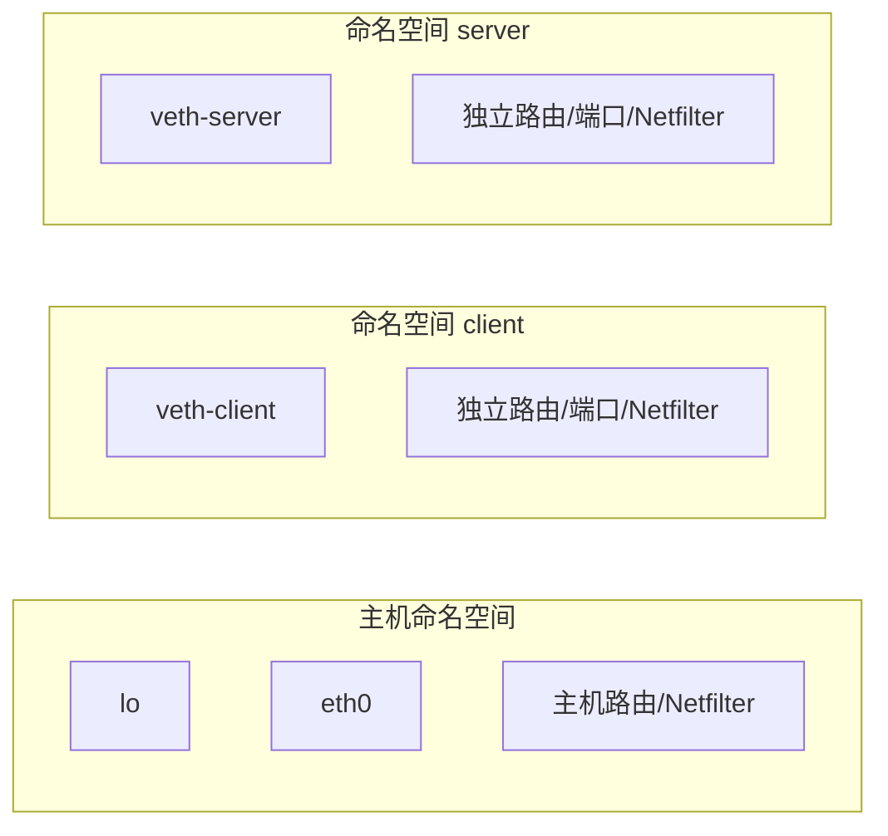
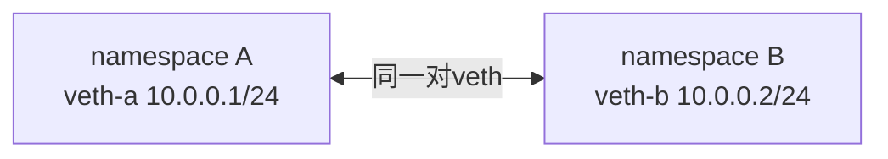
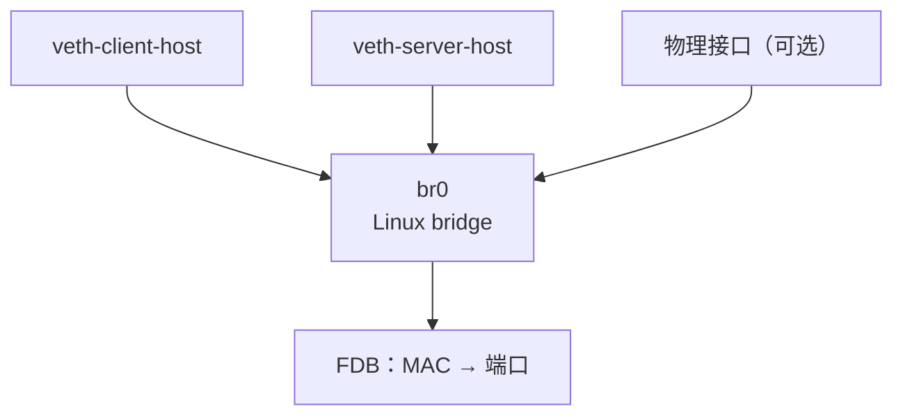
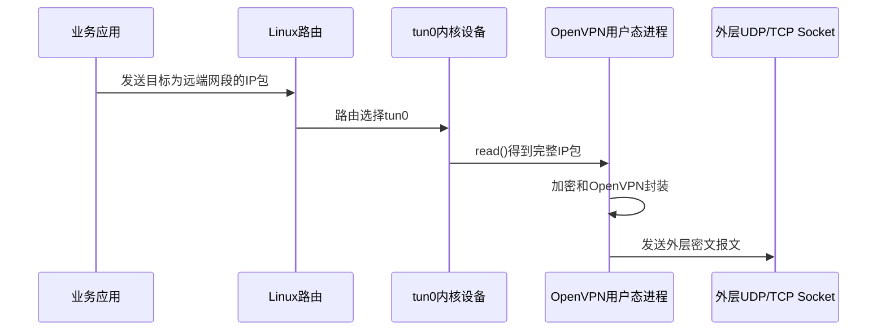
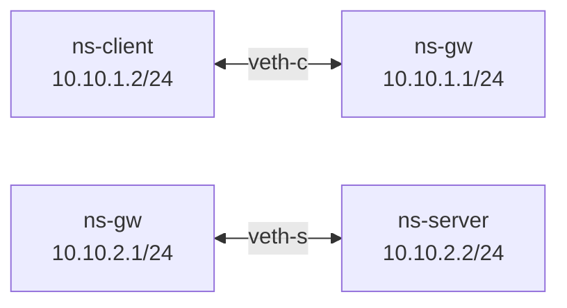

虚拟网络不是“假的网络”。它使用真实的Linux网络栈，只是把端点、链路或设备用软件对象表示。安全网关实验、容器网络、VPN客户端和网络隔离都依赖这些能力。

本篇要建立的核心认识是：

```text
Namespace决定“属于哪套网络世界”
veth提供“两端相连的虚拟网线”
Bridge提供“二层交换”
路由决定“三层下一跳”
TUN把三层IP包交给用户态程序
TAP把二层以太帧交给用户态程序
```

---

## 1. Network Namespace：一台内核里的多套网络世界

网络命名空间（network namespace）隔离网络设备、IPv4/IPv6协议栈、路由表、防火墙规则、`/proc/net`视图和端口空间等资源。Linux手册明确说明了这些隔离范围。[network_namespaces(7)](https://man7.org/linux/man-pages/man7/network_namespaces.7.html)



同一个TCP端口可以在不同命名空间中分别监听，因为它们拥有独立的网络栈视图。进程属于某个网络命名空间；它创建的Socket、看到的接口和路由由该命名空间决定。

### 为什么这对VPN学习有价值

一台虚拟机里可以创建“客户端、网关、服务器”三个命名空间，模拟三台主机：

```text
client namespace
→ 虚拟链路
→ gateway namespace
→ 虚拟链路
→ server namespace
```

这样可以学习路由、转发、Netfilter、TUN和XFRM，而不必立即准备三台物理设备。它仍然是同一个内核，因此不能证明跨内核、跨厂商或真实网卡性能。

---

## 2. veth：成对出现的虚拟网线

veth设备总是成对创建。包从一端发送，会立即在另一端作为接收包出现。官方[veth(4)](https://man7.org/linux/man-pages/man4/veth.4.html)把它描述为相互连接的虚拟以太网设备。



veth两端可以放在不同命名空间，也可以把一端接入bridge。它承载二层以太帧，因此会看到MAC地址、ARP/邻居发现和以太网头。

关键源码坐标：`drivers/net/veth.c`。第一次阅读只跟：

```text
创建一对设备
→ 一端发送
→ 把skb转交给peer
→ peer端作为接收路径继续处理
```

不要把veth理解成“自动路由器”。它只是链路。两端能否访问其他网段，仍由地址、路由、转发和防火墙决定。

---

## 3. Bridge：软件二层交换机

Linux bridge按MAC地址学习和转发以太帧，作用类似二层交换机。多个物理或虚拟接口可以作为端口接入同一bridge。



Bridge核心源码位于`net/bridge/`。最先理解三件事：

1. 收到帧后根据源MAC学习入口；
2. 根据目的MAC查FDB，决定单播转发或泛洪；
3. bridge本身也可拥有三层地址，此时主机可参与该二层网络。

常用观察命令：

```bash
bridge link show
bridge fdb show
ip -d link show type bridge
```

Bridge不等于路由器。跨IP网段需要三层路由；bridge主要决定同一二层域内帧从哪个端口出去。

---

## 4. TUN/TAP：把内核网络包交给用户态

TUN/TAP通过字符设备`/dev/net/tun`在内核网络栈与用户态程序之间传递包。官方文档区分：[TUN](https://docs.kernel.org/networking/tuntap.html)读写IP包，TAP读写以太帧。

### 4.1 TUN的数据方向



反向则是：

```text
外层Socket收到密文
→ OpenVPN验证并解密
→ write()把内层IP包写入TUN
→ 内核把它视为从tun0收到的包
→ 路由到本机应用或其他网络
```

### 4.2 “读”和“写”为什么容易凭直觉说反

从用户进程视角：

- `read(tun_fd)`：读取内核准备从TUN交给用户态处理的包；
- `write(tun_fd)`：把用户态产生/解密的包注入内核接收路径。

从网络设备视角，方向描述可能采用“设备发送/设备接收”，所以阅读内核源码时必须先说明观察者是谁。

### 4.3 TUN关键源码坐标

`drivers/net/tun.c`是主线源码入口。第一轮只找：

```text
用户态打开/dev/net/tun
→ ioctl(TUNSETIFF)创建或附着设备
→ read/readv从队列取包
→ write/writev把包注入网络栈
→ poll/epoll如何感知可读写
```

然后再把这些坐标映射到OpenVPN：OpenVPN维护TUN FD与网络Socket FD，在事件循环中决定先读哪一侧、怎样转换包、再写到另一侧。

---

## 5. 一台虚拟机搭建三节点实验

这个实验用于理解网络结构，不是产品部署方式。执行会修改当前测试机的网络命名空间，需要管理员权限；只能在可恢复的实验虚拟机中进行。

### 5.1 目标拓扑



### 5.2 创建命名空间

```bash
sudo ip netns add ns-client
sudo ip netns add ns-gw
sudo ip netns add ns-server
```

状态变化：内核新增三个相互隔离的网络命名空间。此时它们只有未启用的`lo`，还没有连接。

### 5.3 创建两对veth并分别放入命名空间

```bash
sudo ip link add veth-c type veth peer name veth-gc
sudo ip link set veth-c netns ns-client
sudo ip link set veth-gc netns ns-gw

sudo ip link add veth-gs type veth peer name veth-s
sudo ip link set veth-gs netns ns-gw
sudo ip link set veth-s netns ns-server
```

这里没有bridge，因为网关需要在两个不同网段间做三层转发，而不是把它们放进同一个二层广播域。

### 5.4 配置地址并启用接口

```bash
sudo ip -n ns-client address add 10.10.1.2/24 dev veth-c
sudo ip -n ns-gw address add 10.10.1.1/24 dev veth-gc
sudo ip -n ns-gw address add 10.10.2.1/24 dev veth-gs
sudo ip -n ns-server address add 10.10.2.2/24 dev veth-s

sudo ip -n ns-client link set lo up
sudo ip -n ns-client link set veth-c up
sudo ip -n ns-gw link set lo up
sudo ip -n ns-gw link set veth-gc up
sudo ip -n ns-gw link set veth-gs up
sudo ip -n ns-server link set lo up
sudo ip -n ns-server link set veth-s up
```

### 5.5 添加默认路由并开启网关转发

```bash
sudo ip -n ns-client route add default via 10.10.1.1
sudo ip -n ns-server route add default via 10.10.2.1
sudo ip netns exec ns-gw sysctl -w net.ipv4.ip_forward=1
```

注意最后一条修改的是`ns-gw`中的IPv4转发设置，而不是自动替所有命名空间开启。

### 5.6 分层验证

先验证每一段直连：

```bash
sudo ip netns exec ns-client ping -c 2 10.10.1.1
sudo ip netns exec ns-server ping -c 2 10.10.2.1
```

再验证经网关转发：

```bash
sudo ip netns exec ns-client ping -c 3 10.10.2.2
```

同时观察网关两端：

```bash
sudo ip netns exec ns-gw ip -s link
sudo ip netns exec ns-gw ip route
```

如果直连通、跨网段不通，优先检查网关转发与防火墙，而不是veth本身。

### 5.7 清理

```bash
sudo ip netns delete ns-client
sudo ip netns delete ns-gw
sudo ip netns delete ns-server
```

删除命名空间会一并清理其中的veth端；先运行`ip netns list`核对名称，避免删除其他实验环境。

---

## 6. 怎样把实验升级为VPN学习环境

### 路线A：加入OpenVPN/TUN

在`ns-client`与`ns-gw`之间先保留一条“公网”veth链路，在两端运行OpenVPN；OpenVPN创建TUN后，再让业务网段路由指向TUN。观察点包括：

```text
客户端业务包
→ 客户端TUN
→ OpenVPN外层UDP
→ 公网veth
→ 网关OpenVPN
→ 网关TUN
→ FORWARD
→ ns-server
```

### 路线B：加入strongSwan/XFRM

在`ns-client`与`ns-gw`之间运行IKE守护进程，协商后检查各命名空间的XFRM State/Policy。业务包不进入用户态TUN，而是在内核路由路径中按Policy触发ESP。

### 为什么先做普通转发

如果没有先证明普通路由和FORWARD可用，VPN失败时就无法区分：

- 底层虚拟链路问题；
- 地址或路由问题；
- 防火墙问题；
- VPN控制面问题；
- VPN数据面问题。

先建立无VPN基线，再逐层增加TUN或XFRM，是最省时间的实验方法。

---

## 7. Namespace实验的边界

它能够证明：

- Linux协议栈、路由、Netfilter和XFRM的功能路径；
- 组件在受控拓扑中的配置与交互；
- 故障注入与计数器/PCAP的对应关系。

它不能独立证明：

- 跨不同内核和异厂商实现互通；
- 物理网卡、NUMA、多队列和真实链路性能；
- 真实HSM/密码卡驱动和DMA行为；
- 产品固件中的补丁、硬件卸载和管理面逻辑；
- 生产环境安全性与稳定性。

---

## 8. 本篇掌握检查

1. Namespace隔离了哪些网络对象？为什么同一端口可以在不同Namespace中监听？
2. veth、bridge和路由器分别工作在哪一层，承担什么不同职责？
3. 从OpenVPN进程视角，`read(tun_fd)`和`write(tun_fd)`分别意味着什么？
4. 为什么三节点实验中网关两侧不用bridge，而是两个网段和IP转发？
5. 单虚拟机Namespace实验通过后，为什么仍不能宣称异厂商VPN互通或达到生产性能？

---

## 9. 权威资料

- [network_namespaces(7)](https://man7.org/linux/man-pages/man7/network_namespaces.7.html)
- [veth(4)](https://man7.org/linux/man-pages/man4/veth.4.html)
- [bridge(8)](https://man7.org/linux/man-pages/man8/bridge.8.html)
- [Linux Universal TUN/TAP device driver](https://docs.kernel.org/networking/tuntap.html)
- [Linux network devices](https://docs.kernel.org/networking/netdevices.html)
