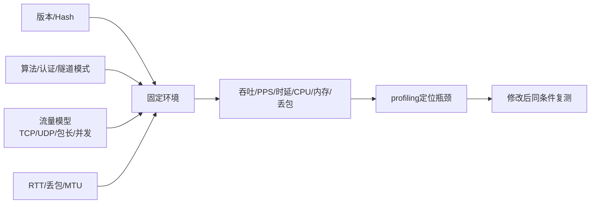

> **原稿实验记录**：以下保留原稿中的实验方法、观察与结果。本页未提供完整原始证据包，脚本路径是原实验资产的定位信息，不是本站下载地址。本次整理没有重跑实验，也不把这些记录标为已公开复核的实测结果。


## 1. Benchmark不是“跑一次iperf3”

性能基线必须固定被测版本、硬件/虚拟机、算法、隧道数、方向、包大小、MTU、网络损伤、采集工具和运行次数。否则两个吞吐数字没有可比性。



## 2. 工具各自回答什么

| 工具 | 回答的问题 | 不能单独证明什么 |
| --- | --- | --- |
| iperf3 | TCP/UDP吞吐、重传、抖动、丢包和应用数据报数量 | 不能单独说明瓶颈在哪，也不能把UDP数据报数直接当网卡PPS |
| tc/netem | 延迟、丢包、乱序等受控网络损伤 | 不代表真实公网所有特征 |
| ping/tracepath | RTT、连通性、PMTU现象 | Ping通不等于业务吞吐正常 |
| tcpdump/Wireshark | 外层协议、包数、包长、SPI和时间分布 | 加密流量不能直接显示内层业务内容 |
| ip -s xfrm | SA、算法、方向和包/字节计数 | 会显示敏感会话密钥，不能直接外发 |
| perf | CPU周期、指令、上下文切换等 | 虚拟机或权限可能让部分硬件计数器不可用 |
| pidstat/top/sar | 进程、CPU、内存与系统变化 | 采样结果需要与同一测试时间线对齐 |

## 3. 手工命令路径

先建立IKEv2/ESP隧道并确认`CHILD_SA INSTALLED`，再按下列顺序测量。

### 3.1 基线吞吐

右端启动一次性服务端：

```bash
sudo ip netns exec gmbench-right iperf3 -s -B 10.20.2.1 -1
```

左端发起5秒单流测试：

```bash
sudo ip netns exec gmbench-left iperf3 \
  -c 10.20.2.1 -B 10.20.1.1 -t 5 -P 1 -J
```

- `-c`指定服务端；
- `-B`固定受保护的内层源地址；
- `-t`是测试秒数；
- `-P 1`是单并发流；
- `-J`保留机器可解析的JSON原始结果。

### 3.2 网络损伤

```bash
sudo ip netns exec gmbench-left tc qdisc replace dev wan0 root \
  netem delay 20ms loss 1%
sudo ip netns exec gmbench-left tc -s qdisc show dev wan0
```

这在左端外层出口增加单向20ms延迟和1%随机丢包。复测后清除：

```bash
sudo ip netns exec gmbench-left tc qdisc del dev wan0 root
```

必须保存`tc -s`结果，否则不能证明预设损伤真的挂载。

### 3.3 MTU边界

```bash
sudo ip -n gmbench-left link set wan0 mtu 1300
sudo ip -n gmbench-right link set wan0 mtu 1300
sudo ip netns exec gmbench-left tracepath -n 10.20.2.1
sudo ip netns exec gmbench-left ping -I 10.20.1.1 -M do -s 1200 -c 3 10.20.2.1
sudo ip netns exec gmbench-left ping -I 10.20.1.1 -M do -s 1400 -c 1 10.20.2.1
```

`-M do`禁止IPv4分片；1200成功、1400出现`Message too long`构成一组正负向证据。

### 3.4 UDP小包方法

```bash
sudo ip netns exec gmbench-left iperf3 \
  -c 10.20.2.1 -B 10.20.1.1 -u -b 20M -l 64 -t 5 -J
```

`-u`使用UDP，`-b`设目标比特率，`-l 64`设应用负载64字节。数据报数/时间可以描述应用数据报速率，但ESP封装、链路帧和网卡实际PPS要由PCAP或硬件计数进一步确认。

## 4. 自动回归

自动脚本和原始数据保存在本地受限实验资产目录；知识库保留测试方法、结果摘要与判读边界。

```bash
sudo ./lab/run-vpn-benchmark.sh
```

脚本依次建立标准IKEv2隧道、运行基线TCP、20ms/1%网络损伤、MTU正负向、UDP 64字节、XFRM/接口统计、perf和PCAP采集。JSON和原始日志保留，摘要由脚本从JSON生成，避免人工抄数字。

## 5. 首轮真实结果

测试环境：同一虚拟机的两个namespace，strongSwan 6.0.3自编译产物，IKE/ESP均为AES/SHA2标准算法，单隧道、单TCP流。

| 场景 | 发送吞吐 | 接收吞吐 | TCP重传 |
| --- | ---: | ---: | ---: |
| 无网络损伤 | 447.98 Mbit/s | 448.10 Mbit/s | 274 |
| 单向20ms + 1%丢包 | 7.76 Mbit/s | 6.47 Mbit/s | 34 |

UDP 64字节、20 Mbit/s目标：接收19.98 Mbit/s，5秒发送195295个数据报，约39059 datagrams/s；接收端报告0.84%丢包。外层XFRM计数持续增长，证明流量经过ESP，而不是绕过隧道。

MTU设为1300后，`tracepath`给出约1230的受保护路径PMTU；1200字节ICMP负载成功，1400字节负载被本机以`Message too long`拒绝。

`perf`得到30.30ms task-clock、116次上下文切换和255次缺页，但当前虚拟化环境不支持cycles/instructions硬件事件。这些字段应标记不可用，不能填零。

最终回归目录：`benchmark-20260928-163612`；外层PCAP SHA-256：`9d6b8d6624e6b9598773059229da50944a29cad6a230f1c38b3ec7ea39495477`。

## 6. 怎样正确解读这组数字

- 445 Mbit/s不是产品指标，抓包、veth、虚拟机调度和同机CPU都会影响它；
- 网络损伤后的吞吐下降证明工具链能制造并观测敏感场景，不代表产品一定有问题；
- 高重传提示单次短测噪声较大，正式基线应预热、至少重复3次并记录中位数与离散度；
- 下一阶段要补建链速率、并发隧道、双向流、多包长、长稳和CPU绑核；
- 找到实际瓶颈后，才决定优化算法调用、XFRM、网卡队列、AF_XDP或DPDK，不能先选技术再找理由。
