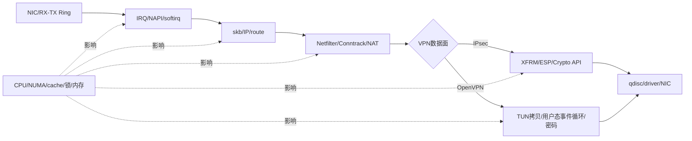

> **配套材料**：本文引用的网络编程示例与只读快照脚本见[源码与使用说明](/downloads/network-examples.zip)。解压后保留 `examples/` 目录结构；脚本未在本次发布中重新实测。


性能优化的第一原则不是“使用更快的技术”，而是找出时间和CPU究竟消耗在哪一层。

```text
建立可重复基线
→ 按层收集计数与Profile
→ 提出一个可证伪的瓶颈假设
→ 只改变一个主要变量
→ 重测吞吐、PPS、时延、CPU和错误
→ 保留或回滚
```

本篇把网卡队列、NAPI/软中断、CPU分布、卸载、XFRM、OpenVPN用户态和未来XDP/DPDK放到同一张性能地图中。

---

## 1. 先明确优化指标

“VPN快”不是可执行目标。至少要区分：

| 指标 | 说明 | 容易互相牺牲的因素 |
| --- | --- | --- |
| 吞吐（Gbps） | 单位时间传输的数据量 | 可能通过大包、批处理提高，但增加时延 |
| PPS | 每秒处理包数 | 小包更容易暴露每包固定开销 |
| 平均/尾时延 | 请求延迟，重点看P95/P99 | 队列和批处理会影响尾时延 |
| 并发隧道/会话 | 同时维持多少SA、连接或用户 | 内存、锁、定时器和硬件会话资源 |
| 建链速率 | 每秒建立多少IKE/TLS会话 | 密钥交换、签名和证书验证 |
| CPU效率 | 每Gbps或每Mpps消耗多少核 | 用户/内核/软中断分布 |
| 丢包与重传 | 压力下的正确性 | 队列、ring、拥塞、MTU和错误处理 |

控制面与数据面必须分测：

- IKE/TLS建链慢，瓶颈可能在签名、证书、KEM、状态机或HSM会话；
- ESP/OpenVPN吞吐慢，瓶颈可能在逐包密码、拷贝、软中断、队列、单线程、TUN、XFRM、Netfilter或网卡。

---

## 2. 一张性能瓶颈地图



每一层都有自己的计数和工具。优化前的任务是找出：

```text
哪个资源先饱和
哪个队列开始积压
哪个计数开始丢包
哪组函数占用CPU
性能随包长、并发和核数怎样变化
```

---

## 3. 多队列、RSS、RPS、RFS与XPS

Linux官方扩展性文档区分了多种把网络处理分散到CPU/队列的机制。[Linux scaling documentation](https://docs.kernel.org/networking/scaling.html)

### 3.1 RSS：网卡硬件选择接收队列

网卡根据报文头计算哈希，把不同流量分配到多个RX队列。每个队列通常对应IRQ，并可设置CPU亲和性。

作用：让接收处理并行，减少单个CPU成为瓶颈。

风险：

- 队列数过多会增加中断和缓存开销；
- 某些流哈希不均导致单队列热点；
- IRQ与处理线程、内存所在NUMA节点不匹配。

### 3.2 RPS：软件把接收处理分配到其他CPU

当硬件队列不足或分配不理想时，RPS可在软件层根据流哈希选择CPU。

作用：提高并行度。

代价：增加跨CPU排队、IPI和缓存迁移，不能假设开启越多越快。

### 3.3 RFS：尽量让包靠近消费它的应用CPU

RFS在RPS基础上考虑处理该流的应用所在CPU，改善数据缓存局部性。它更适合本地Socket工作负载；纯转发或不同应用模型下收益需要实测。

### 3.4 XPS：选择发送队列

XPS用于把发送流量映射到CPU或RX队列相关的TX队列，目标是减少锁竞争和改善缓存局部性。

### 3.5 观察命令

```bash
ethtool -l eth0
ethtool -x eth0
grep -E 'eth0|mlx|ixgbe|i40e|virtio' /proc/interrupts
find /sys/class/net/eth0/queues -maxdepth 2 -type f \
  \( -name rps_cpus -o -name rps_flow_cnt -o -name xps_cpus \) \
  -print
```

先记录当前分布，再做亲和性或队列调整。自动调优服务、irqbalance和容器CPU限制都可能影响结果。

---

## 4. NAPI与软中断：CPU忙在哪里

网络接收大量运行在`NET_RX`软中断相关上下文，发送完成和其他处理也会体现在软中断与驱动统计中。

```bash
cat /proc/softirqs
cat /proc/net/softnet_stat
mpstat -P ALL 1
```

没有`mpstat`时可先用`top -H`、`pidstat`或`perf`观察，但需要区分：

- 用户态CPU：OpenVPN、控制面、管理服务；
- 系统态CPU：系统调用、协议栈、Netfilter、XFRM；
- softirq：NAPI与网络包处理；
- iowait通常不是“网络CPU等待”的通用指标。

### `ksoftirqd`高就一定是坏事吗

不一定。它说明软中断工作被推迟到内核线程等上下文处理，常见于预算用尽或系统繁忙，但结论必须结合：

- 吞吐是否达到目标；
- 丢包/积压是否增长；
- CPU是否单核饱和；
- IRQ和队列是否不均；
- 包长和并发结构；
- Profile中真正的热点函数。

---

## 5. 卸载：减少CPU，也可能改变观测

| 机制 | 主要作用 | 可能的观测影响 |
| --- | --- | --- |
| checksum offload | 由NIC计算/验证校验和 | 本机抓包可能显示未完成校验和 |
| TSO/GSO | 延后大包分段 | 抓包看到比MTU大的逻辑包 |
| GRO/LRO | 合并接收包 | 本机包数减少、单包变大 |
| XFRM offload | NIC/设备承担IPsec部分或全部处理 | 软件热点下降，但需要设备/驱动证据 |

查看能力与当前状态：

```bash
ethtool -k eth0
ethtool -S eth0
```

不要为了“抓包好看”就在生产环境永久关闭卸载。可以在隔离实验中做A/B对比，并记录修改前后状态和恢复步骤。

---

## 6. IPsec和OpenVPN的性能瓶颈不同

### 6.1 IPsec/XFRM常见瓶颈

- 内核密码实现或算法缺少CPU指令优化；
- 单流无法充分分散到多核；
- XFRM查找、SA/Policy规模和缓存行为；
- Netfilter/Conntrack规则与状态规模；
- 软中断或单队列饱和；
- ESP封装导致MTU下降和分片；
- 密码卡逐包提交、DMA和PCIe开销；
- XFRM/inline offload能力及驱动限制。

### 6.2 OpenVPN传统用户态常见瓶颈

- 单事件循环或单隧道处理并行度；
- TUN与Socket之间的用户/内核态切换和数据拷贝；
- 用户态密码处理；
- 包队列、锁和内存分配；
- TCP承载TCP产生的耦合问题；
- DCO不可用时所有数据包进入用户态；
- DCO存在但不支持目标算法时回退到用户态。

### 6.3 怎样确认，而不是猜

```text
固定硬件、内核、构建和配置
→ 分别测单流/多流、大包/小包、加密/不加密基线
→ 记录每核CPU、软中断、接口drop、XFRM/TUN计数
→ perf确认热点位于用户态、内核协议栈还是密码函数
→ 只改变一个主要变量重测
```

如果SM4微基准很快，但VPN吞吐低，不应继续只优化SM4轮函数。瓶颈可能在每包调用、拷贝、队列或单线程。

---

## 7. `perf`怎样回答“CPU花在哪里”

### 7.1 先看全局热点

```bash
sudo perf top
```

在受控压测期间观察热点是用户进程、内核网络函数、密码函数、内存复制还是锁。

### 7.2 记录一次可重复实验

```bash
sudo perf record -a -g -- sleep 30
sudo perf report
```

这会记录30秒系统级采样并保留调用图。`perf`权限由`kernel.perf_event_paranoid`等设置控制；不能读取时不要为了方便直接永久降低安全策略，应在批准的实验环境调整。

### 7.3 Profile的边界

- 采样热点表示CPU时间集中，不自动说明逻辑错误；
- 未出现的函数可能被内联、卸载或采样不足；
- 缺少符号会降低可读性；
- 虚拟机结果会受到宿主调度、虚拟网卡和频率控制影响；
- 只看百分比而不看总吞吐，可能把“系统整体更快但某函数占比提高”误判为退化。

---

## 8. MTU、分片与“能ping小包但业务不通”

VPN封装增加外层IP、UDP、ESP或OpenVPN头，减少可承载的内层有效载荷。若路径MTU和MSS处理不正确，常出现：

- 小ping正常，大包或HTTPS卡住；
- 某些方向正常，另一方向丢包；
- 禁止分片且ICMP Packet Too Big被防火墙丢弃；
- 重传增加、吞吐下降、CPU升高。

逐步检查：

```bash
ip link show
ip route get 目标IP
tracepath 目标IP
ping -M do -s 适当大小 目标IP
```

IPv4和IPv6、隧道模式和传输模式、NAT-T与否都会改变开销。不要复制一个固定MTU值到所有产品配置；应从实际封装计算并用PMTU实验验证。

---

## 9. 什么时候进入XDP、AF_XDP或DPDK

### 9.1 XDP

XDP在驱动接收路径的早期运行eBPF程序，适合早期丢弃、重定向、负载分担和轻量处理。它不能自动替代完整的VPN协议栈、复杂状态机和所有Netfilter语义。

### 9.2 AF_XDP

AF_XDP让用户态程序通过专用ring与XDP路径高效收发包，减少传统Socket路径开销。它仍要求设计内存、队列、CPU亲和性和用户态协议处理。

### 9.3 DPDK

DPDK使用用户态轮询驱动、HugePage、批处理和显式队列管理绕开或减少传统内核网络路径开销。它能提高PPS和可控性，但会带来：

- 独占或重配置网卡队列；
- 更复杂的路由、防火墙、可观测性和运维集成；
- 高CPU轮询成本；
- 现有XFRM、Netfilter和内核生态能力需要替代或重新接入；
- VPN控制面与高速数据面的状态同步问题。

### 9.4 进入高速路径的门槛

只有当以下结论成立时才应进入架构选型：

```text
目标性能已量化
→ 现有路径已建立公平基线
→ perf/计数证明瓶颈位于可被新路径消除的部分
→ 功能、安全、可观测性和运维迁移成本已评估
→ 有可回滚的原型和对照测试
```

否则“上DPDK”只是把未知瓶颈搬到一个更难排查的系统里。

---

## 10. 一套分层排障表

| 层 | 关键问题 | 主要观察 |
| --- | --- | --- |
| 业务 | 流量是否真实产生，成功标准是什么 | 请求日志、吞吐/时延、失败率 |
| VPN控制面 | SA/会话是否正确建立和轮换 | IKE/TLS日志、握手PCAP、会话状态 |
| VPN数据面 | TUN或XFRM计数是否增长 | `ip -s link`、`ip -s xfrm`、外层PCAP |
| 路由/策略 | 包选了哪个出口和保护路径 | `ip route get`、`ip rule`、Policy |
| Netfilter | 是否命中、丢弃或NAT | nft计数/trace、Conntrack |
| 网络栈 | 是否出现协议错误、重传、软中断积压 | `nstat`、`ss -ti`、softnet统计 |
| 设备 | ring、drop、IRQ、链路是否异常 | `ethtool -S/-l/-k`、接口统计、interrupts |
| CPU/内存 | 哪个核和函数饱和，是否跨NUMA | `perf`、每核CPU、NUMA与亲和性 |

---

## 11. 配套快照工具怎样使用

仓库`examples/linux-kernel-network-path/inspect_kernel_network.sh`提供只读快照。它不会修改网络配置，会把当时的接口、路由、Socket、Netfilter、Conntrack、XFRM、软中断和队列状态分别保存为原始文本。

先手工执行并理解最关键的命令：

```bash
ip -s link
ip route show table all
ip rule show
ss -s
nstat -az
ip -s xfrm state  # 本地核对；输出可能含会话密钥，不得直接外发
ip -s xfrm policy
cat /proc/softirqs
cat /proc/net/xfrm_stat
```

再运行自动快照：

```bash
cd examples/linux-kernel-network-path
./inspect_kernel_network.sh /tmp/kernel-net-before
```

压测或复现后再次执行：

```bash
./inspect_kernel_network.sh /tmp/kernel-net-after
```

比较两次目录，重点看差值。输出可能包含IP、接口、规则和本机拓扑，不要未经脱敏提交到仓库或对外发送。XFRM State中的会话密钥由脚本在内存管道中替换为`<redacted-key>`，不会以原文写入快照。

---

## 12. 本篇掌握检查

1. RSS、RPS、RFS和XPS分别在哪一侧、解决什么问题？
2. 为什么看到`ksoftirqd`高不能直接得出“必须上DPDK”？
3. 本机抓包显示大于MTU的包时，为什么要先检查GSO/TSO/GRO？
4. 怎样通过实验区分密码算法慢、TUN拷贝慢和单个RX队列饱和？
5. 引入DPDK前必须有哪些测量与架构条件？
6. 为什么性能优化必须同时记录正确性、丢包和尾时延，而不能只看峰值Gbps？

---

## 13. 权威资料

- [Linux scaling: RSS, RPS, RFS and XPS](https://docs.kernel.org/networking/scaling.html)
- [Linux NAPI](https://docs.kernel.org/networking/napi.html)
- [Linux XFRM device offload](https://docs.kernel.org/networking/xfrm/xfrm_device.html)
- [Linux networking sysctl](https://docs.kernel.org/admin-guide/sysctl/net.html)
- [Linux network devices](https://docs.kernel.org/networking/netdevices.html)
