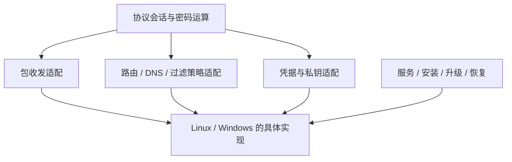

## “能够编译”只覆盖了第一层

跨平台 VPN 至少包含四件事：协议与密码库能运行、业务包能进出隧道、网络配置能正确生效、安装与退出能恢复系统。第一项通过并不意味着后三项成立。

本文用 Linux TUN 与 Windows 的公开接口建立职责对照，不提供已经验证的 Windows 客户端，也不假设某个发行版或驱动组合可直接复用。

## 包接口与策略接口要分开

Linux TUN 向用户态提供三层包接口，TAP 提供二层帧接口。程序通过设备文件描述符读写，路由和设备配置决定哪些流量进入该接口。[Linux TUN/TAP 文档](https://docs.kernel.org/networking/tuntap.html)

Windows Wintun 是三层 TUN 驱动；WFP 是包含过滤层、管理与 callout 的过滤平台。二者解决不同问题：不能把“创建虚拟适配器”和“设置应用流量策略”视为同一个 API 的平台替换。[Wintun](https://www.wintun.net/)、[Microsoft WFP 架构](https://learn.microsoft.com/en-us/windows/win32/fwp/windows-filtering-platform-architecture-overview)

图中的适配拆分是**设计示例**，没有暗示某个现有仓库采用这些模块名。

## 四份契约比一层通用包装更有用

| 契约 | 必须说清楚 | 典型失败 |
| --- | --- | --- |
| Packet I/O | 包边界、长度、缓冲区所有权、取消与关闭 | 关闭时仍访问已释放缓冲区 |
| Network configuration | 配置归属、地址/路由/DNS 生效顺序、撤销 | 重连后遗留旧路由，或误删其他软件的路由 |
| Credentials | 证书用途、私钥是否可导出、签名调用路径 | 找得到证书但无法使用其私钥 |
| Service lifecycle | 启动权限、用户会话、崩溃恢复、升级 | UI 退出后特权服务与驱动状态失联 |

这里最重要的是所有权。谁创建对象，谁有权删除；应用崩溃后，由谁根据可持久识别的信息清理。不要用“删除同名接口或路由”代替身份判断，因为名称可能已被另一实例使用。

## 私钥接口也属于平台适配

证书可被解析，与私钥可被使用是两种能力。将证书导出为 PEM，并不能推出其关联私钥允许导出。需要沿真实调用链确认：协议请求签名时，由密码库、Provider、系统密钥存储接口还是设备 SDK 完成。

这一点与[OpenVPN / Tongsuo 双证书生命周期](/articles/openvpn-tongsuo-dual-cert/)有直接联系：证书槽位、用途、私钥消费者和协议消息必须配对。平台迁移后，仍应逐个核对这些关系，不能只检查证书列表。

## 一份可执行的适配验收表

以下是**待验证用例**，不是兼容性声明：

1. 启动后记录接口身份、地址、路由和 DNS；建立隧道，分别测试目标网段和不应入隧道的流量。
2. 在相同拓扑中断开隧道，确认只撤销本实例创建的网络对象。
3. 在数据收发时终止 UI 或服务，分别观察谁仍存活、网络配置是否残留。
4. 切换网络接口，检查重连、地址变化和旧会话销毁，不只看界面状态。
5. 升级与回滚驱动/服务组合，记录签名、权限、版本和安装失败恢复。

每条用例都应在平台矩阵中固定操作系统构建、架构、驱动版本、协议程序版本和密码后端。矩阵里的“未测试”有信息价值，不要用“理论兼容”填满空格。

## 尚未确认的部分

本文没有选择 Windows 包驱动，没有验证 WFP callout，也没有验证麒麟、统信或其他发行版的实际版本组合。当前可复用的是接口问题清单与观测方法；实际实现仍需从目标版本源码和一个最小双向业务实验开始。

接着读[网络编程到 VPN 的映射](/articles/network-programming-vpn/)，可以看到哪些事件循环与所有权问题是跨平台共有的，哪些网络调用必须落回操作系统。
